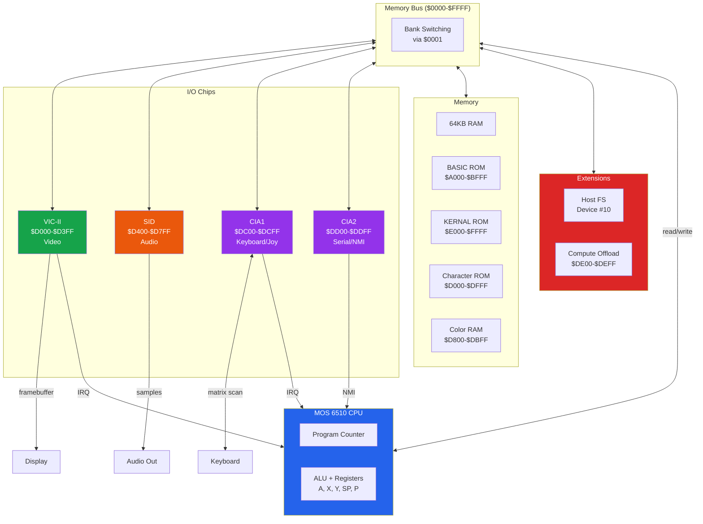
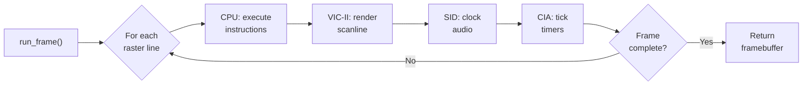
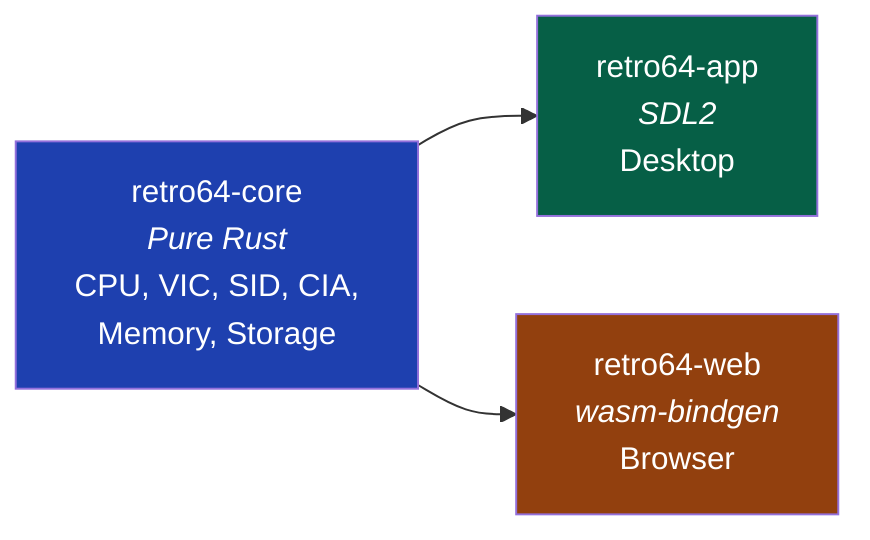

# Retro 64

A Commodore 64 emulator written in Rust, targeting desktop (SDL2), web browsers (WebAssembly), and embeddable use as a library.

Emulates the MOS 6510 CPU, VIC-II video, SID audio, CIA I/O, magnetic tape and floppy disk storage, with extensions for host filesystem access and compute offload.

## System Architecture



## Emulation Loop



## Workspace Structure



## Quick Start

### Desktop

```bash
cargo build --release
cargo run -- --load program.prg
cargo run -- --rom-dir ./roms --load game.d64 --model pal --scale 3
```

### Web (WASM)

```bash
cargo install wasm-pack
cd crates/retro64-web
wasm-pack build --target web --release
python3 -m http.server 8080
# Open http://localhost:8080/index.html
```

### Testing

```bash
cargo test              # 38 CPU tests + integration tests
cargo test -p retro64-core  # Core library only
```

## Embedding the Core

### Rust

```rust
use retro64_core::system::C64;
use retro64_core::config::Config;

let mut c64 = C64::new(Config::default());
c64.reset();

// Load a program
let prg = std::fs::read("game.prg").unwrap();
c64.load_prg(&prg);

// Run and render
loop {
    let framebuffer: &[u32] = c64.run_frame(); // ARGB8888 pixels
    let audio: Vec<i16> = c64.drain_audio();   // 48kHz mono samples
    // ... render framebuffer, play audio
}
```

### JavaScript (WASM)

```javascript
import init, { WebEmulator } from './pkg/retro64_web.js';

await init();
const emu = new WebEmulator("pal");

// Animation loop
function frame() {
    emu.run_frame();
    const ptr = emu.framebuffer_ptr();
    // ... render to Canvas via ImageData
    requestAnimationFrame(frame);
}
requestAnimationFrame(frame);
```

### BASIC Example

```basic
10 REM *** BOUNCING BALL ***
20 X=160:Y=100:DX=2:DY=1
30 POKE 53281,0:POKE 53280,0
40 X=X+DX:Y=Y+DY
50 IF X<1 OR X>38 THEN DX=-DX
60 IF Y<1 OR Y>23 THEN DY=-DY
70 POKE 1024+Y*40+X,81
80 FOR T=1 TO 20:NEXT T
90 POKE 1024+Y*40+X,32
100 GOTO 40
```

## Features

| Component | Status | Details |
|-----------|--------|---------|
| MOS 6510 CPU | Complete | All official opcodes + undocumented (LAX, SAX, DCP, ISC, SLO, RLA, SRE, RRA, ANC, ALR, ARR, SBX). BCD decimal mode. |
| VIC-II Video | Complete | Standard text, multicolor text, standard bitmap, multicolor bitmap, extended BG color. 8 sprites. Raster IRQ. Badline cycle stealing. |
| SID Audio | Complete | 3 voices, 4 waveforms (triangle/sawtooth/pulse/noise), ADSR envelopes, programmable filter. |
| CIA I/O | Complete | 8x8 keyboard matrix, 2 joystick ports, dual 16-bit timers, TOD clock. |
| Memory | Complete | 64KB RAM, full bank switching (8 configs), built-in open-source ROMs. |
| Storage: PRG | Complete | 2-byte header + raw program data. |
| Storage: D64 | Complete | 35-track floppy images, directory, BAM, sector chains. |
| Storage: T64 | Complete | Tape archive container. |
| Storage: TAP | Parsed | Pulse timing data parsed; real-time tape loading not yet implemented. |
| Storage: CRT | Complete | Standard 8K/16K cartridges. |
| Host Filesystem | Complete | Virtual IEC device #10 for LOAD/SAVE to host OS. |
| Compute Offload | Complete | 32-bit math (mul/div/mod/sqrt/sin/cos), memory fill/copy at $DE00. |
| PAL Model | Complete | 985,248 Hz, 312 lines, 63 cycles/line, 50.12 FPS. |
| NTSC Model | Complete | 1,022,730 Hz, 263 lines, 65 cycles/line, 59.83 FPS. |
| Desktop (SDL2) | Complete | Video, audio, keyboard, joystick. macOS/Linux/Windows. |
| Web (WASM) | Complete | Canvas rendering, Web Audio, keyboard. 83KB WASM binary. |

## Use Cases

**Desktop Emulator** — Run classic C64 software with `cargo run -- --load game.d64`. Supports PAL/NTSC switching, warp mode for fast-forward, and original ROM images for maximum compatibility.

**Web Emulator** — Host the emulator on any web server. Users drag-and-drop `.prg` files onto the canvas. No installation needed — runs entirely in the browser at 50/60 FPS.

**Embedded Core** — `retro64-core` has zero platform dependencies. Embed it in game engines, testing frameworks, or custom tools. The API is `C64::new()` → `run_frame()` → read framebuffer/audio.

**C64 Development** — Write and test BASIC or assembly programs. The compute offload extension provides fast 32-bit math and memory operations not available on real hardware.

**Education** — Study 8-bit computer architecture hands-on. The modular codebase mirrors real hardware: separate CPU, video, audio, and I/O chip implementations.

## Color Palette

The VIC-II's 16-color Pepto palette:

| Index | Color | Hex | Index | Color | Hex |
|-------|-------|-----|-------|-------|-----|
| 0 | Black | `#000000` | 8 | Orange | `#DD8855` |
| 1 | White | `#FFFFFF` | 9 | Brown | `#664400` |
| 2 | Red | `#880000` | 10 | Light Red | `#FF7777` |
| 3 | Cyan | `#AAFFEE` | 11 | Dark Grey | `#333333` |
| 4 | Purple | `#CC44CC` | 12 | Medium Grey | `#777777` |
| 5 | Green | `#00CC55` | 13 | Light Green | `#AAFF66` |
| 6 | Blue | `#0000AA` | 14 | Light Blue | `#0088FF` |
| 7 | Yellow | `#EEEE77` | 15 | Light Grey | `#BBBBBB` |

## Documentation

| Document | Contents |
|----------|----------|
| [Architecture](docs/architecture.md) | System block diagram, frame execution sequence, workspace structure |
| [Memory Map](docs/memory-map.md) | 64KB address space, bank switching state machine, VIC-II banks |
| [VIC-II Video](docs/vic-ii.md) | Register reference, graphics mode flowchart, sprites, raster timing |
| [SID Audio](docs/sid.md) | Register reference, signal path diagram, waveforms, ADSR, music examples |
| [Keyboard](docs/keyboard.md) | 8x8 matrix diagram, host key mappings, joystick encoding |
| [Extensions](docs/extensions.md) | Compute offload API with examples, host filesystem guide |
| [Storage Formats](docs/storage-formats.md) | PRG, D64, TAP, T64, CRT specifications with diagrams |
| [Configuration](docs/configuration.md) | CLI flags, PAL vs NTSC comparison, ROM setup |
| [Web Emulator](docs/web.md) | WASM build guide, browser architecture diagram, JS examples |

## Test Corpus

BASIC programs in `tests/corpus/basic/`:

| Program | Tests |
|---------|-------|
| `hello.bas` | Screen output, PRINT |
| `fibonacci.bas` | Arithmetic, FOR loops, variables |
| `mandelbrot.bas` | Floating-point math, nested loops, POKE |
| `sorting.bas` | Arrays (DIM), comparisons, swapping |
| `sound_test.bas` | SID registers, C major scale |
| `graphics_test.bas` | Bitmap mode, VIC-II register switching |
| `disk_test.bas` | OPEN, PRINT#, INPUT#, CLOSE |

## License

MIT
