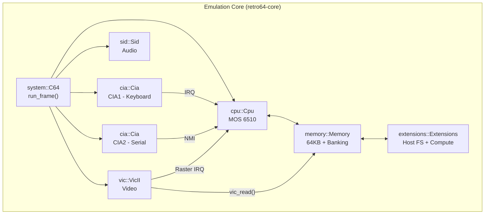
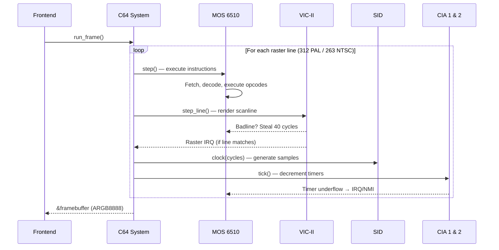

# Retro64 System Architecture

## System Component Overview

The Commodore 64 emulator faithfully models the hardware interconnections of the
original system. All chips share the same 16-bit address bus and 8-bit data bus,
arbitrated by the PLA (Programmable Logic Array) that handles bank switching.

```
                         +------------------+
                         |   CPU  (6510)    |
                         |  @ 0.985 MHz PAL |
                         |  @ 1.023 MHz NTSC|
                         +--------+---------+
                                  |
                    +-------------+-------------+
                    |      16-bit Address Bus   |
                    |       8-bit Data Bus      |
                    +--+--+--+--+--+--+--+--+--+
                       |  |  |  |  |  |  |  |
          +------------+  |  |  |  |  |  |  +------------+
          |               |  |  |  |  |  |               |
  +-------+-------+      |  |  |  |  |  |       +-------+-------+
  |   RAM (64 KB) |      |  |  |  |  |  |       | KERNAL ROM    |
  |  $0000-$FFFF  |      |  |  |  |  |  |       | $E000-$FFFF   |
  +---------------+      |  |  |  |  |  |       +---------------+
                         |  |  |  |  |  |
  +---------------+      |  |  |  |  |  |       +---------------+
  | BASIC ROM     |      |  |  |  |  |  |       | Character ROM |
  | $A000-$BFFF   |      |  |  |  |  |  |       | $D000-$DFFF   |
  +---------------+      |  |  |  |  |  |       +---------------+
                         |  |  |  |  |  |
        +----------------+  |  |  |  |  +----------------+
        |                   |  |  |  |                   |
+-------+-------+   +------+--+--+------+   +-----------+-+
|  VIC-II       |   | Color RAM | SID   |   |  CIA 1      |
|  $D000-$D3FF  |   | $D800     | $D400 |   |  $DC00      |
|  Video chip   |   | $DBFF     | $D7FF |   |  Keyboard/  |
|  (MOS 6569)   |   |  1K x 4  | Audio |   |  Joystick   |
+---------------+   +-----------+-------+   +-------------+
                                  |
                         +--------+--------+
                         |                 |
                   +-----+-----+   +-------+-------+
                   |  CIA 2    |   | Extensions    |
                   |  $DD00    |   | $DE00 - $DEFF |
                   |  Serial/  |   | $DF00 - $DFFF |
                   |  User Port|   | (Cartridges)  |
                   +-----------+   +---------------+
```

### System Architecture Diagram



### Chip Address Ranges

| Chip           | Address Range   | Size   | Description                        |
|----------------|-----------------|--------|------------------------------------|
| **VIC-II**     | `$D000-$D3FF`  | 1 KB   | Video Interface Controller II      |
| **SID**        | `$D400-$D7FF`  | 1 KB   | Sound Interface Device             |
| **Color RAM**  | `$D800-$DBFF`  | 1 KB   | 4-bit color nybble storage         |
| **CIA 1**      | `$DC00-$DCFF`  | 256 B  | Keyboard, joystick, datasette      |
| **CIA 2**      | `$DD00-$DDFF`  | 256 B  | Serial bus, user port, VIC banking |
| **Extension 1**| `$DE00-$DEFF`  | 256 B  | I/O area 1 (cartridge)             |
| **Extension 2**| `$DF00-$DFFF`  | 256 B  | I/O area 2 (cartridge)             |

---

## Emulation Data Flow

The emulation loop is driven by the video chip's raster timing. Each frame
consists of a fixed number of raster lines (312 for PAL, 263 for NTSC).
Each raster line consists of 63 cycles (PAL) or 65 cycles (NTSC).

```
run_frame()
  |
  |   for each raster line (0..311 PAL / 0..262 NTSC):
  |     |
  |     +---> step_line()
  |             |
  |             |   for each cycle in line (0..62 PAL / 0..64 NTSC):
  |             |     |
  |             |     +---> VIC-II: check for badlines, DMA steal
  |             |     |       |
  |             |     |       +---> If badline: steal 40-43 cycles from CPU
  |             |     |       +---> If sprite fetch: steal 2 cycles per sprite
  |             |     |
  |             |     +---> CPU: step one cycle (if not stolen)
  |             |     |       |
  |             |     |       +---> Fetch / Decode / Execute
  |             |     |       +---> Memory access via bus (PLA bank switching)
  |             |     |
  |             |     +---> CIA 1: clock timers, check IRQ
  |             |     +---> CIA 2: clock timers, check NMI
  |             |     +---> SID: clock oscillators & envelopes
  |             |
  |             +---> VIC-II: render line to framebuffer
  |             +---> VIC-II: check raster IRQ
  |
  +---> Present framebuffer to host display
  +---> Collect audio samples from SID ring buffer
```

### Frame Execution Sequence



### Simplified Frame Loop (Rust)

```rust
// Simplified from system.rs
impl C64 {
    pub fn run_frame(&mut self) -> &[u32] {
        self.vic.frame_complete = false;
        while !self.vic.frame_complete {
            self.step_line();  // CPU + VIC + SID + CIA per raster line
        }
        &self.vic.framebuffer
    }
}
```

### Cycle-Exact Timing

The VIC-II has highest bus priority and can "steal" cycles from the CPU:

| Event              | Cycles Stolen | Condition                           |
|--------------------|---------------|-------------------------------------|
| Badline detection  | 40-43         | When DEN=1 and YSCROLL matches      |
| Sprite 0 fetch     | 2             | When sprite 0 is enabled and in range |
| Sprite 1 fetch     | 2             | When sprite 1 is enabled and in range |
| ...                | ...           | (up to 8 sprites)                   |
| Sprite pointer     | 1 per sprite  | p-access for each active sprite     |

---

## Workspace Structure

The project is organized as a Cargo workspace with three crates:

```
retro64/
  |
  +-- Cargo.toml              (workspace root)
  +-- CLAUDE.md               (project conventions)
  +-- roms/                   (ROM images: basic, kernal, chargen)
  +-- tests/                  (integration / screenshot tests)
  +-- docs/                   (this documentation)
  |
  +-- crates/
       |
       +-- retro64-core/       Platform-independent emulation core
       |     +-- src/
       |     |     +-- lib.rs
       |     |     +-- cpu.rs         6510 CPU (all opcodes incl. undocumented)
       |     |     +-- memory.rs      PLA bank switching, bus arbitration
       |     |     +-- vic.rs         VIC-II video chip
       |     |     +-- sid.rs         SID audio chip
       |     |     +-- cia.rs         CIA 1 & CIA 2
       |     |     +-- color_ram.rs   4-bit color nybble RAM
       |     |     +-- machine.rs     Top-level C64 state & run_frame()
       |     |     +-- cartridge.rs   Cartridge slot / extensions
       |     +-- Cargo.toml
       |
       +-- retro64-app/        SDL2 desktop application
       |     +-- src/
       |     |     +-- main.rs        Entry point, SDL2 init, event loop
       |     |     +-- video.rs       SDL2 texture streaming
       |     |     +-- audio.rs       SDL2 audio callback
       |     |     +-- input.rs       SDL2 keyboard & joystick mapping
       |     +-- Cargo.toml
       |
       +-- retro64-web/        WASM browser application
             +-- src/
             |     +-- lib.rs         wasm-bindgen entry point
             |     +-- video.rs       Canvas 2D / WebGL rendering
             |     +-- audio.rs       Web Audio API integration
             |     +-- input.rs       DOM keyboard event mapping
             +-- Cargo.toml
```

### Crate Dependencies

```
retro64-app (bin)          retro64-web (cdylib)
     |                          |
     |   depends on             |   depends on
     v                          v
  +-----------------------------+
  |       retro64-core (lib)    |
  |   (no_std compatible,       |
  |    #[cfg(feature="std")]    |
  |    for optional file I/O)   |
  +-----------------------------+
```

- **retro64-core**: Pure Rust, `no_std` compatible. Exposes `Machine` struct
  with `run_frame(&mut self, framebuf: &mut [u8], audio_buf: &mut [f32])`.
  No platform dependencies. All timing constants are configurable for PAL/NTSC.

- **retro64-app**: Uses `sdl2` crate for window creation, input events,
  audio playback, and texture rendering. Targets Linux, macOS, Windows.

- **retro64-web**: Uses `wasm-bindgen` and `web-sys` to bridge into browser
  APIs. Compiled with `wasm-pack` to produce a `.wasm` + JS glue module.

---

## Threading Model

```
+----------------------------------------------------------+
|                    Main Thread                            |
|                                                          |
|   +--------------------------------------------------+   |
|   |              Event Loop (60 Hz)                  |   |
|   |                                                  |   |
|   |   1. Poll host input events (keyboard/joystick)  |   |
|   |   2. Map to C64 keyboard matrix / joystick bits  |   |
|   |   3. run_frame() -- single-threaded emulation    |   |
|   |      - Steps all 312/263 raster lines            |   |
|   |      - Produces RGBA framebuffer (404x284 PAL)   |   |
|   |      - Fills SID audio ring buffer               |   |
|   |   4. Upload framebuffer to GPU texture           |   |
|   |   5. Present frame                               |   |
|   +--------------------------------------------------+   |
|                         |                                 |
|                         | SID samples (ring buffer)       |
|                         v                                 |
|   +--------------------------------------------------+   |
|   |         Audio Callback Thread                    |   |
|   |   (driven by SDL2 / Web Audio)                   |   |
|   |                                                  |   |
|   |   - Pulls samples from lock-free ring buffer     |   |
|   |   - Resamples from ~985 kHz to 44.1/48 kHz      |   |
|   |   - Fills platform audio buffer                  |   |
|   +--------------------------------------------------+   |
+----------------------------------------------------------+
```

### Synchronization Details

| Aspect             | Mechanism                                              |
|--------------------|--------------------------------------------------------|
| Frame pacing       | `std::thread::sleep` or `requestAnimationFrame` (web)  |
| Audio transfer     | Lock-free SPSC ring buffer (`AtomicUsize` read/write)  |
| Input delivery     | Written from main thread before `run_frame()`          |
| No mutexes needed  | Emulation core is single-threaded; only the audio ring buffer crosses threads |

The audio ring buffer is sized to hold 2-3 frames worth of samples
(~3300 samples at 48 kHz / 60 Hz) to absorb scheduling jitter without
introducing audible latency.

### Web (WASM) Differences

In the browser build, there is no dedicated audio thread controlled by us.
Instead, the Web Audio API drives an `AudioWorkletProcessor` that pulls
samples from a `SharedArrayBuffer`-backed ring buffer. The emulation loop
runs inside `requestAnimationFrame`, which the browser calls at display
refresh rate (~60 Hz).

```
Browser Main Thread             AudioWorklet Thread
  |                               |
  | requestAnimationFrame         | process() callback
  | -> run_frame()                | -> read from SharedArrayBuffer
  | -> write to SharedArrayBuffer | -> output 128-sample blocks
  |                               |
```
