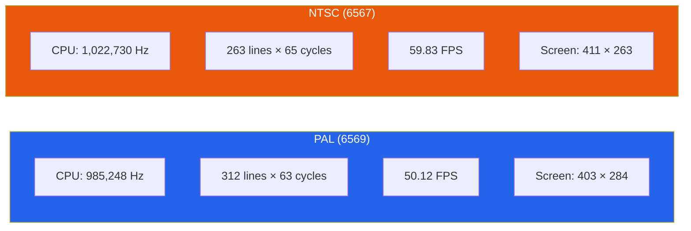

# Configuration

## CLI Flags

| Flag               | Description                                       | Default    |
|--------------------|---------------------------------------------------|------------|
| `--load FILE`      | Load file on startup (.prg, .d64, .t64, .crt)    | none       |
| `--rom-dir DIR`    | Directory containing kernal, basic, chargen ROMs  | built-in   |
| `--model MODEL`    | System model: `pal` or `ntsc`                     | `pal`      |
| `--warp`           | Run at maximum speed (no frame limiter)           | off        |
| `--extensions`     | Enable host filesystem + compute offload          | off        |
| `--hostfs DIR`     | Host filesystem root directory for device #10     | none       |
| `--joystick-port N`| Joystick port 1 or 2                              | 2          |
| `--scale N`        | Window scale factor                               | 2          |

### Examples

Run with a PRG file in PAL mode:

```bash
retro64 --load game.prg --model pal
```

Enable extensions and mount a host directory:

```bash
retro64 --extensions --hostfs ~/c64files --load demo.prg
```

NTSC mode at 3x scale with warp speed:

```bash
retro64 --model ntsc --scale 3 --warp --load benchmark.prg
```

### Full Options Example

```bash
# Basic usage
cargo run -- --load game.prg

# Full options
cargo run -- \
    --load game.d64 \
    --rom-dir ./roms \
    --model pal \
    --scale 3 \
    --extensions \
    --hostfs ./programs \
    --joystick-port 2
    
# Warp mode (max speed, useful for testing)
cargo run -- --load test.prg --warp
```

## PAL vs NTSC Comparison

Retro64 emulates both the PAL and NTSC variants of the VIC-II and the
corresponding CPU clock speeds.



| Property                | PAL (6569)     | NTSC (6567)    |
|-------------------------|----------------|----------------|
| CPU Frequency           | 985,248 Hz     | 1,022,730 Hz   |
| Lines per Frame         | 312            | 263            |
| Cycles per Line         | 63             | 65             |
| Frame Rate              | 50.12 Hz       | 59.83 Hz       |
| Screen (with borders)   | 403 x 284      | 411 x 263      |
| Visible Display         | 320 x 200      | 320 x 200      |

### Timing Notes

- **PAL** is the more common choice for European software. Many demos and some games
  rely on PAL-specific timing (e.g., stable raster routines tuned for 63 cycles per
  line).
- **NTSC** adds 2 extra cycles per scanline and has fewer scanlines per frame. Some
  PAL-only software will exhibit visual glitches or timing issues under NTSC.
- The visible display area (320 x 200 pixels) is the same on both systems. The
  difference lies in the border size and total raster area.

## ROM Setup

Retro64 ships with built-in open-source replacement ROMs that provide basic
Commodore 64 compatibility out of the box. For full compatibility, you can supply
the original Commodore ROM files.

### Using Built-in Replacement ROMs

No configuration needed. Simply run `retro64` and the built-in replacements are used
automatically. These replacements cover standard BASIC and Kernal functionality but
may not be 100% compatible with all software.

### Using Original Commodore ROMs

1. Obtain the three ROM files from a legitimate source (e.g., dumped from your own
   Commodore 64):

   | ROM File   | Size       | Description                   |
   |------------|------------|-------------------------------|
   | `kernal`   | 8,192 bytes | Kernal ROM ($E000-$FFFF)     |
   | `basic`    | 8,192 bytes | BASIC interpreter ($A000-$BFFF) |
   | `chargen`  | 4,096 bytes | Character generator ROM       |

2. Place all three files in a single directory, keeping the filenames exactly as
   shown above (lowercase, no extension).

3. Point Retro64 to that directory:

   ```bash
   retro64 --rom-dir /path/to/roms
   ```

### ROM File Checksums

You can verify your ROM dumps with these SHA-256 checksums for the standard
Commodore 64 revision 3 ROMs:

| File     | SHA-256 (first 16 hex chars)  |
|----------|-------------------------------|
| kernal   | `39065497630802346bce...`     |
| basic    | `79015323128650c742a3...`     |
| chargen  | `adc7c31e18c7c7413d54...`    |

### Troubleshooting

- **"ROM file not found"** -- Ensure the files are named `kernal`, `basic`, and
  `chargen` (no `.bin` or `.rom` extension).
- **"ROM size mismatch"** -- The kernal and basic ROMs must be exactly 8,192 bytes;
  chargen must be exactly 4,096 bytes.
- **Compatibility issues with built-in ROMs** -- Some software (particularly
  fastloaders and copy-protected programs) requires the original Commodore ROMs.
  Use `--rom-dir` to point to authentic ROM dumps.
