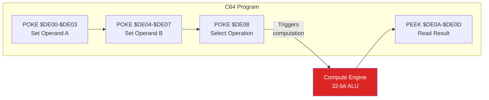

# Retro64 Extensions

Retro64 provides optional hardware extensions that go beyond standard Commodore 64
functionality. Enable them with the `--extensions` flag.

## Compute Offload ($DE00-$DEFF)

The compute offload unit is mapped into the I/O expansion area at $DE00-$DEFF. It
exposes fast 32-bit arithmetic, trigonometric helpers, and bulk memory operations to
programs running on the emulated 6510.



### Register Map

| Address       | Width  | Access | Description                                |
|---------------|--------|--------|--------------------------------------------|
| $DE00-$DE03   | 32-bit | R/W    | Operand A (little-endian)                  |
| $DE04-$DE07   | 32-bit | R/W    | Operand B (little-endian)                  |
| $DE08         | 8-bit  | W      | Operation select (write triggers compute)  |
| $DE09         | 8-bit  | R      | Status / flags                             |
| $DE0A-$DE0D   | 32-bit | R      | Result (little-endian, read-only)          |
| $DE10-$DE11   | 16-bit | R/W    | Memory fill target address (little-endian) |
| $DE12-$DE13   | 16-bit | R/W    | Memory fill length (little-endian)         |
| $DE14         | 8-bit  | R/W    | Fill value                                 |
| $DE15         | 8-bit  | W      | Fill trigger (any write starts the fill)   |
| $DE20-$DE21   | 16-bit | R/W    | Memory copy source address (little-endian) |
| $DE22-$DE23   | 16-bit | R/W    | Memory copy dest address (little-endian)   |
| $DE24-$DE25   | 16-bit | R/W    | Memory copy length (little-endian)         |
| $DE26         | 8-bit  | W      | Copy trigger (any write starts the copy)   |
| $DE30         | 8-bit  | R      | Random number (changes on each read)       |

### Operations

Write one of the following codes to **$DE08** to execute the corresponding operation.
The result is available immediately in $DE0A-$DE0D.

| Code | Operation   | Description                          |
|------|-------------|--------------------------------------|
| 0x00 | Multiply   | A * B -> Result                      |
| 0x01 | Divide     | A / B -> Result                      |
| 0x02 | Modulo     | A % B -> Result                      |
| 0x03 | Square Root| sqrt(A) -> Result                    |
| 0x04 | Sine       | sin(A * 2 * pi / 256) * 256 -> Result|
| 0x05 | Cosine     | cos(A * 2 * pi / 256) * 256 -> Result|
| 0x06 | Absolute   | \|A\| -> Result                      |
| 0x07 | Negate     | -A -> Result                         |

### Status Flags ($DE09)

| Bit | Meaning                |
|-----|------------------------|
| 0   | Zero (result is 0)     |
| 1   | Overflow               |
| 7   | Divide-by-zero error   |

### BASIC Programming Examples

#### 32-bit Multiply

Multiply 1000 by 50 using the compute offload and read the 32-bit result.

```basic
10 REM -- SET OPERAND A = 1000 ($03E8) --
20 POKE 56832, 232 : REM $DE00 = $E8
30 POKE 56833, 3   : REM $DE01 = $03
40 POKE 56834, 0   : REM $DE02 = $00
50 POKE 56835, 0   : REM $DE03 = $00
60 REM -- SET OPERAND B = 50 ($0032) --
70 POKE 56836, 50  : REM $DE04 = $32
80 POKE 56837, 0   : REM $DE05 = $00
90 POKE 56838, 0   : REM $DE06 = $00
100 POKE 56839, 0  : REM $DE07 = $00
110 REM -- TRIGGER MULTIPLY --
120 POKE 56840, 0  : REM $DE08 = 0x00 (MULTIPLY)
130 REM -- READ 32-BIT RESULT --
140 R = PEEK(56842) + PEEK(56843)*256
150 R = R + PEEK(56844)*65536 + PEEK(56845)*16777216
160 PRINT "1000 * 50 ="; R
```

#### Sine Table Lookup

Read precomputed sine values using the trig operation. Operand A holds the
angle as an 8-bit value (0-255 maps to 0-2*pi).

```basic
10 REM -- PRINT A SINE CURVE --
20 FOR I = 0 TO 255 STEP 8
30   POKE 56832, I : POKE 56833, 0
40   POKE 56834, 0 : POKE 56835, 0
50   POKE 56840, 4 : REM SINE OPERATION
60   S = PEEK(56842) : IF S > 127 THEN S = S - 256
70   C = 20 + INT(S * 19 / 128)
80   PRINT TAB(C); "*"
90 NEXT I
```

#### Fast Memory Fill

Fill 256 bytes at address $0400 (screen RAM) with the value 1 (the letter "A").

```basic
10 REM -- SET FILL ADDRESS = $0400 --
20 POKE 56848, 0   : REM $DE10 = $00 (low byte)
30 POKE 56849, 4   : REM $DE11 = $04 (high byte)
40 REM -- SET FILL LENGTH = 256 --
50 POKE 56850, 0   : REM $DE12 = $00 (low byte)
60 POKE 56851, 1   : REM $DE13 = $01 (high byte)
70 REM -- SET FILL VALUE --
80 POKE 56852, 1   : REM $DE14 = 1 (letter A)
90 REM -- TRIGGER FILL --
100 POKE 56853, 0  : REM $DE15 (any value triggers)
```

#### Memory Copy

Copy the 1000 bytes of screen RAM from $0400 to $C000.

```basic
10 REM -- SOURCE = $0400 --
20 POKE 56864, 0 : POKE 56865, 4
30 REM -- DEST = $C000 --
40 POKE 56866, 0 : POKE 56867, 192
50 REM -- LENGTH = 1000 ($03E8) --
60 POKE 56868, 232 : POKE 56869, 3
70 REM -- TRIGGER COPY --
80 POKE 56870, 0 : REM $DE26
```

#### Random Numbers

Read a hardware random number on each access.

```basic
10 FOR I = 1 TO 10
20   PRINT PEEK(56880) : REM $DE30
30 NEXT I
```

### Complete Examples

#### Multiply Two Large Numbers

```basic
10 REM *** COMPUTE OFFLOAD: MULTIPLY ***
20 REM Multiply 1000 × 2500
30 B = 56832: REM $DE00 base
40 REM Set operand A = 1000 ($000003E8)
50 POKE B+0, 232: POKE B+1, 3: POKE B+2, 0: POKE B+3, 0
60 REM Set operand B = 2500 ($000009C4)
70 POKE B+4, 196: POKE B+5, 9: POKE B+6, 0: POKE B+7, 0
80 REM Trigger multiply (operation 0)
90 POKE B+8, 0
100 REM Read 32-bit result
110 R = PEEK(B+10) + PEEK(B+11)*256 + PEEK(B+12)*65536
120 PRINT "1000 x 2500 ="; R
```

#### Fast Screen Clear

```basic
10 REM *** FAST SCREEN CLEAR ***
20 B = 56832: REM $DE00 base
30 REM Fill address = $0400 (screen), length = 1000
40 POKE B+16, 0: POKE B+17, 4: REM addr = $0400
50 POKE B+18, 232: POKE B+19, 3: REM length = 1000
60 POKE B+20, 32: REM fill with space character
70 POKE B+21, 1: REM trigger fill
80 PRINT "SCREEN CLEARED INSTANTLY!"
```

## Host Filesystem -- Device #10

The host filesystem extension maps a directory on the host machine as a virtual
Commodore drive accessible as device number 10.

### Enabling

Pass both `--extensions` and `--hostfs` on the command line:

```
retro64 --extensions --hostfs /path/to/directory
```

### Usage

From BASIC or machine language, use the standard Kernal LOAD and SAVE routines with
device number 10.

**Load a file:**

```
LOAD "MYPROGRAM",10
```

**Load to a specific address (machine language):**

```
LOAD "GAME",10,1
```

**Save a file:**

```
SAVE "BACKUP",10
```

### File Format

All files are stored in standard **.PRG format** on the host filesystem: a 2-byte
little-endian load address followed by the raw program data. When you SAVE to device
10 the emulator writes a `.prg` file; when you LOAD, it reads the two-byte header to
determine where in C64 memory the data should be placed.

### Directory Listing

To view available files, load the directory listing as you would on a real drive:

```
LOAD "$",10
LIST
```

### Walkthrough

```bash
# Enable extensions and mount a directory
cargo run -- --extensions --hostfs ./my_programs --load hello.prg

# From BASIC on the C64:
# LOAD "MYFILE",10       — Load from host directory
# SAVE "OUTPUT",10       — Save to host directory
# LOAD "$",10            — List host directory
```

### Notes

- Filenames are case-insensitive and mapped to the host OS conventions.
- Wildcards (`*`, `?`) are supported in LOAD and directory listings.
- Sequential and relative file access (OPEN/PRINT#/INPUT#) is not currently
  supported -- only LOAD and SAVE operations work with device 10.
