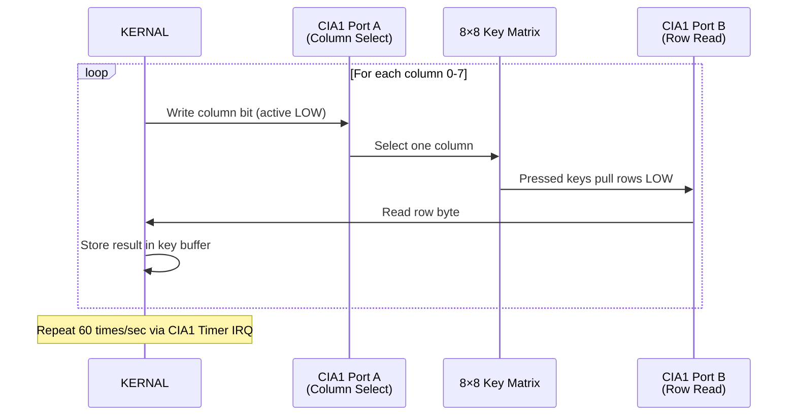

# Keyboard Matrix & Input Mapping

The Commodore 64 keyboard is scanned via CIA 1 ($DC00-$DC01) as an 8x8 matrix.
The emulator maps host keyboard events to this matrix. Joystick ports share
CIA 1 lines, so the mapping must account for both simultaneously.

---

## C64 Keyboard Matrix (8 x 8)

CIA 1 Port A (`$DC00`, active-low output) selects matrix columns.
CIA 1 Port B (`$DC01`, active-low input) reads matrix rows.

To scan: write a 0-bit to the desired column in Port A, then read Port B.
A 0-bit in Port B means that key is pressed.

```
              Port A ($DC00) - Column Select (directly active low)
              Bit 7    Bit 6    Bit 5    Bit 4    Bit 3    Bit 2    Bit 1    Bit 0
             Col 7    Col 6    Col 5    Col 4    Col 3    Col 2    Col 1    Col 0
           +--------+--------+--------+--------+--------+--------+--------+--------+
  Row 0    | RUN/   |   Q    |   C=   |  SPACE |   2    |  CTRL  |  <-    |   1    |
  Bit 0    | STOP   |        | (Cmdre)|        |        |        | (arrow)|        |
           +--------+--------+--------+--------+--------+--------+--------+--------+
  Row 1    |  /     |  ^     |   =    | R.SHFT |  HOME  |   ;    |   *    |  INST/ |
  Bit 1    |        |(up arr)|        |        |        |        |        |  DEL   |
           +--------+--------+--------+--------+--------+--------+--------+--------+
  Row 2    |   ,    |   @    |   :    |   .    |  -     |   L    |   P    |   +    |
  Bit 2    |        |        |        |        |        |        |        |        |
           +--------+--------+--------+--------+--------+--------+--------+--------+
  Row 3    |   N    |   O    |   K    |   M    |   0    |   J    |   I    |   9    |
  Bit 3    |        |        |        |        |        |        |        |        |
           +--------+--------+--------+--------+--------+--------+--------+--------+
P Row 4    |   V    |   U    |   H    |   B    |   8    |   G    |   Y    |   7    |
o Bit 4    |        |        |        |        |        |        |        |        |
r          +--------+--------+--------+--------+--------+--------+--------+--------+
t Row 5    |   X    |   T    |   F    |   C    |   6    |   D    |   R    |   5    |
  Bit 5    |        |        |        |        |        |        |        |        |
B          +--------+--------+--------+--------+--------+--------+--------+--------+
  Row 6    | L.SHFT |   E    |   S    |   Z    |   4    |   A    |   W    |   3    |
  Bit 6    |        |        |        |        |        |        |        |        |
           +--------+--------+--------+--------+--------+--------+--------+--------+
  Row 7    | CRSR   |  F5    |  F3    |  F1    | CRSR   | RETURN |  F7    | DELETE |
  Bit 7    | DOWN   |        |        |        | RIGHT  |        |        |(rubout)|
           +--------+--------+--------+--------+--------+--------+--------+--------+
```

### Matrix Coordinates Quick Reference

| C64 Key    | Row | Col | Port A Mask | Port B Bit |
|------------|-----|-----|-------------|------------|
| 1          |  0  |  0  | `$FE`       | Bit 0      |
| 2          |  0  |  3  | `$F7`       | Bit 0      |
| 3          |  6  |  0  | `$FE`       | Bit 6      |
| 4          |  6  |  3  | `$F7`       | Bit 6      |
| 5          |  5  |  0  | `$FE`       | Bit 5      |
| 6          |  5  |  3  | `$F7`       | Bit 5      |
| 7          |  4  |  0  | `$FE`       | Bit 4      |
| 8          |  4  |  3  | `$F7`       | Bit 4      |
| 9          |  3  |  0  | `$FE`       | Bit 3      |
| 0          |  3  |  3  | `$F7`       | Bit 3      |
| A          |  6  |  2  | `$FB`       | Bit 6      |
| B          |  4  |  4  | `$EF`       | Bit 4      |
| C          |  5  |  4  | `$EF`       | Bit 5      |
| SPACE      |  0  |  4  | `$EF`       | Bit 0      |
| RETURN     |  7  |  1  | `$FD`       | Bit 7      |
| L.SHIFT    |  6  |  7  | `$7F`       | Bit 6      |
| R.SHIFT    |  1  |  4  | `$EF`       | Bit 1      |
| RUN/STOP   |  0  |  7  | `$7F`       | Bit 0      |
| CRSR DOWN  |  7  |  7  | `$7F`       | Bit 7      |
| CRSR RIGHT |  7  |  3  | `$F7`       | Bit 7      |
| INST/DEL   |  7  |  0  | `$FE`       | Bit 7      |
| F1         |  7  |  4  | `$EF`       | Bit 7      |
| F3         |  7  |  5  | `$DF`       | Bit 7      |
| F5         |  7  |  6  | `$BF`       | Bit 7      |
| F7         |  7  |  1  | `$FD`       | Bit 7      |

> **Note:** F2, F4, F6, F8 are accessed by pressing SHIFT + F1/F3/F5/F7
> respectively on a real C64. CRSR UP = SHIFT + CRSR DOWN. CRSR LEFT =
> SHIFT + CRSR RIGHT.

---

## Scanning Algorithm

The KERNAL keyboard scanning routine (at `$EA87`) works as follows:

```
  1. Write $FF to $DC00 (all columns deselected)
  2. Read $DC01 -- if not $FF, some key is pressed
  3. For each column (0-7):
     a. Write column select mask to $DC00 (one bit low)
     b. Read $DC01 to get row data
     c. For each row bit that is 0, that key is pressed
  4. Look up character in decode table based on SHIFT state
  5. Handle key repeat, debounce
```

### Keyboard Scanning Flow



In the emulator, key state is maintained as an 8x8 boolean matrix that
is directly applied to the CIA port read logic.

---

## Host Keyboard Mapping

### SDL2 Desktop Mapping (retro64-app)

| Host Key (SDL2)           | C64 Key                  | Notes                   |
|---------------------------|--------------------------|-------------------------|
| `1` - `0`                 | `1` - `0`                | Direct mapping          |
| `A` - `Z`                 | `A` - `Z`                | Direct mapping          |
| `Space`                   | `SPACE`                  |                         |
| `Return` / `Enter`        | `RETURN`                 |                         |
| `Backspace`               | `INST/DEL`               |                         |
| `Delete`                  | `INST/DEL`               |                         |
| `Left Shift`              | `LEFT SHIFT`             |                         |
| `Right Shift`             | `RIGHT SHIFT`            |                         |
| `Escape`                  | `RUN/STOP`               | Special key             |
| `Tab`                     | `CTRL`                   | Special key             |
| `Left Alt`                | `C=` (Commodore key)     | Special key             |
| `Page Up`                 | `RESTORE` (NMI)          | Directly triggers NMI   |
| `Home`                    | `HOME` (CLR/HOME)        |                         |
| `Up Arrow`                | `CRSR DOWN` + `SHIFT`    | Emulates SHIFT+cursor   |
| `Down Arrow`              | `CRSR DOWN`              |                         |
| `Left Arrow`              | `CRSR RIGHT` + `SHIFT`   | Emulates SHIFT+cursor   |
| `Right Arrow`             | `CRSR RIGHT`             |                         |
| `F1`                      | `F1`                     |                         |
| `F2`                      | `F1` + `SHIFT`           | C64 uses SHIFT+F1       |
| `F3`                      | `F3`                     |                         |
| `F4`                      | `F3` + `SHIFT`           | C64 uses SHIFT+F3       |
| `F5`                      | `F5`                     |                         |
| `F6`                      | `F5` + `SHIFT`           | C64 uses SHIFT+F5       |
| `F7`                      | `F7`                     |                         |
| `F8`                      | `F7` + `SHIFT`           | C64 uses SHIFT+F7       |
| `F9`                      | `^` (up arrow char)      | Hard to type otherwise  |
| `F10`                     | `<-` (back arrow char)   | Hard to type otherwise  |
| `-`                       | `-`                      |                         |
| `=`                       | `=`                      |                         |
| `[`                       | `:`                      | Positional mapping      |
| `]`                       | `;`                      | Positional mapping      |
| `'` (apostrophe)          | `@`                      | Positional mapping      |
| `\`                       | `*`                      | Positional mapping      |
| `,`                       | `,`                      |                         |
| `.`                       | `.`                      |                         |
| `/`                       | `/`                      |                         |
| `` ` `` (backtick)        | `<-` (back arrow char)   | Alternative mapping     |

### Web Browser Mapping (retro64-web)

| Host Key (KeyboardEvent.code) | C64 Key               | Notes                   |
|-------------------------------|------------------------|-------------------------|
| `Digit1` - `Digit0`          | `1` - `0`              | Uses `code`, not `key`  |
| `KeyA` - `KeyZ`              | `A` - `Z`              | Layout-independent      |
| `Space`                       | `SPACE`               |                         |
| `Enter`                       | `RETURN`              |                         |
| `Backspace`                   | `INST/DEL`            | `preventDefault()` used |
| `ShiftLeft`                   | `LEFT SHIFT`          |                         |
| `ShiftRight`                  | `RIGHT SHIFT`         |                         |
| `Escape`                      | `RUN/STOP`            | `preventDefault()` used |
| `Tab`                         | `CTRL`                | `preventDefault()` used |
| `AltLeft`                     | `C=` (Commodore key)  | `preventDefault()` used |
| `PageUp`                      | `RESTORE` (NMI)       | `preventDefault()` used |
| `Home`                        | `HOME`                |                         |
| `ArrowUp`                     | `CRSR DOWN` + SHIFT   | `preventDefault()` used |
| `ArrowDown`                   | `CRSR DOWN`           | `preventDefault()` used |
| `ArrowLeft`                   | `CRSR RIGHT` + SHIFT  | `preventDefault()` used |
| `ArrowRight`                  | `CRSR RIGHT`          | `preventDefault()` used |
| `F1` - `F8`                   | Same as SDL2           | `preventDefault()` used |
| `F9`                          | `^` (up arrow char)   |                         |
| `F10`                         | `<-` (back arrow)     | `preventDefault()` used |
| `Comma`, `Period`, `Slash`    | `,` `.` `/`           |                         |
| `BracketLeft`                 | `:`                   | Positional              |
| `BracketRight`                | `;`                   | Positional              |
| `Quote`                       | `@`                   | Positional              |
| `Backslash`                   | `*`                   | Positional              |
| `Backquote`                   | `<-` (back arrow)     |                         |

> **Web-specific notes:**
> - We use `KeyboardEvent.code` (physical key position) rather than
>   `KeyboardEvent.key` (character output) for layout independence.
> - `preventDefault()` is called for keys that would otherwise trigger
>   browser actions (Tab, Escape, F-keys, arrow keys, etc.).
> - The `keyup`/`keydown` events drive the emulated keyboard matrix.
>   The `keypress` event is not used.

---

## Special Keys

| Host Key      | C64 Function   | Implementation                              |
|---------------|----------------|---------------------------------------------|
| `Page Up`     | RESTORE        | Triggers NMI directly on the CPU, bypasses  |
|               |                | keyboard matrix (hardware NMI line on C64)  |
| `Escape`      | RUN/STOP       | Matrix position Row 0, Col 7                |
| `Left Alt`    | C= (Commodore) | Matrix position Row 0, Col 5                |
| `Tab`         | CTRL           | Matrix position Row 0, Col 2                |

### RESTORE Key Behavior

On real hardware, the RESTORE key is wired directly to the CIA 2 NMI line,
not through the keyboard matrix. Pressing it triggers a Non-Maskable
Interrupt. The KERNAL NMI handler checks if RUN/STOP is also held:

```
  RESTORE alone:        NMI fires, KERNAL checks STOP flag,
                        no visible effect if RUN/STOP not held.

  RUN/STOP + RESTORE:   NMI fires, KERNAL detects STOP key,
                        performs warm reset (BASIC warm start,
                        restores I/O, clears screen).
```

---

## Joystick Input

The C64 has two joystick ports. Joystick signals are active-low and share
the CIA 1 port lines with the keyboard:

- **Joystick Port 2**: Read from CIA 1 Port A (`$DC00`) bits 0-4
- **Joystick Port 1**: Read from CIA 1 Port B (`$DC01`) bits 0-4

### Bit Encoding (Active Low)

```
  Bit    Direction/Button    Active     Inactive
  ===    ================    ======     ========
   0     Up                  0          1
   1     Down                0          1
   2     Left                0          1
   3     Right               0          1
   4     Fire                0          1
```

Reading the port returns all 5 bits simultaneously. Multiple directions
can be active at once (e.g., Up + Right for diagonal movement):

```
  $DC00 value    Meaning (Port 2 example)
  ===========    ========================
  %xxxX 1111     No input (all inactive)
  %xxxX 1110     Up
  %xxxX 1101     Down
  %xxxX 1011     Left
  %xxxX 0111     Right
  %xxxX 0110     Up + Right (diagonal)
  %xxxX 1010     Up + Left (diagonal)
  %xxxX 0101     Down + Right (diagonal)
  %xxxX 1001     Down + Left (diagonal)
  %xxxX 0 ####   Fire button pressed (bit 4 = 0)
  %xxx0 1110     Up + Fire
```

**Note:** `x` bits above represent the keyboard column select output;
the joystick bits are ORed with keyboard data on the same port.

### Joystick-Keyboard Conflict

Because joystick Port 1 shares CIA 1 Port B (the keyboard row input),
pressing joystick directions on Port 1 can appear as phantom key presses.
This is why most C64 games use Port 2 for the primary joystick.

```
  Joystick Port 1           Keyboard Matrix
  Bit 0 (Up)       <---->   Row bit 0 (same physical line)
  Bit 1 (Down)     <---->   Row bit 1
  Bit 2 (Left)     <---->   Row bit 2
  Bit 3 (Right)    <---->   Row bit 3
  Bit 4 (Fire)     <---->   Row bit 4
```

### Host Joystick Mapping

#### SDL2 Desktop (retro64-app)

| Input Source             | C64 Joystick         | Notes                     |
|--------------------------|----------------------|---------------------------|
| Numpad 8 / Gamepad Up    | Port 2 Up            |                           |
| Numpad 2 / Gamepad Down  | Port 2 Down          |                           |
| Numpad 4 / Gamepad Left  | Port 2 Left          |                           |
| Numpad 6 / Gamepad Right | Port 2 Right         |                           |
| Numpad 0 / Gamepad A     | Port 2 Fire          |                           |
| SDL Gamepad mapped       | Either port          | Configurable in settings  |

#### Web Browser (retro64-web)

| Input Source              | C64 Joystick         | Notes                    |
|---------------------------|----------------------|--------------------------|
| Numpad8 / Gamepad axes    | Port 2 Up            | Gamepad API supported    |
| Numpad2 / Gamepad axes    | Port 2 Down          |                          |
| Numpad4 / Gamepad axes    | Port 2 Left          |                          |
| Numpad6 / Gamepad axes    | Port 2 Right         |                          |
| Numpad0 / Gamepad button 0| Port 2 Fire          |                          |

---

## Key Matrix Implementation Detail

The emulator maintains the keyboard state as two arrays representing the
CIA port values:

```rust
pub struct KeyboardMatrix {
    /// 8 column bytes; bit = 0 means key pressed in that row
    columns: [u8; 8],
}

impl KeyboardMatrix {
    /// Press a key at (row, col)
    pub fn key_down(&mut self, row: u8, col: u8) {
        self.columns[col as usize] &= !(1 << row);
    }

    /// Release a key at (row, col)
    pub fn key_up(&mut self, row: u8, col: u8) {
        self.columns[col as usize] |= 1 << row;
    }

    /// Read Port B given Port A column select mask
    pub fn read(&self, port_a: u8) -> u8 {
        let mut result = 0xFF;
        for col in 0..8 {
            if port_a & (1 << col) == 0 {
                result &= self.columns[col];
            }
        }
        result
    }
}
```

This approach allows the CIA read logic to correctly handle scanning
multiple columns simultaneously (some software writes values with
multiple column bits low).
