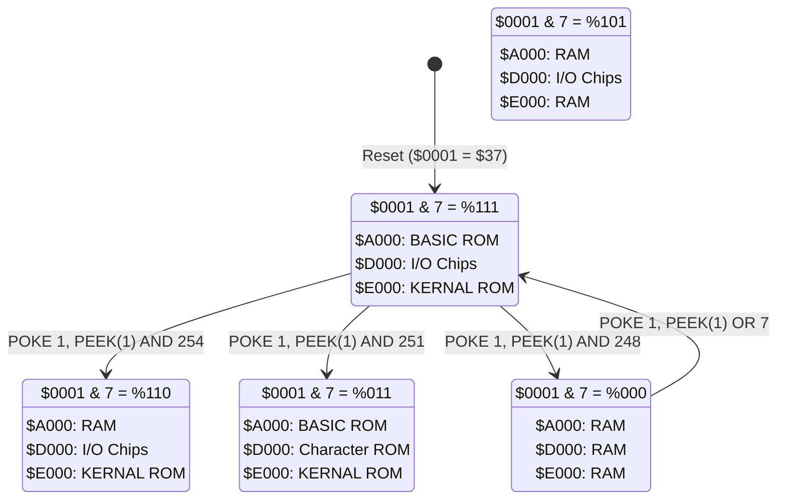
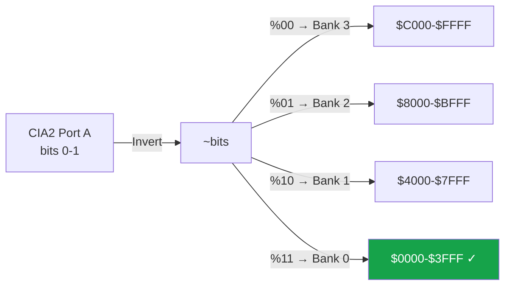

# Retro64 Memory Map

## Full 64 KB Address Space

The Commodore 64 has a 64 KB address space shared between RAM, ROM, and I/O chips.
The PLA (Programmable Logic Array) uses the CPU's I/O port at `$0001` and the active
address to determine which physical device responds on the bus.

```
  Address        Size    Region
  ========       =====   ==========================================

  $FFFF  +------+
         |      |
         |KERNAL|  8 KB   KERNAL ROM  (or RAM when HIRAM=0)
         | ROM  |         Operating system, I/O routines, IRQ/NMI
         |      |         vectors, serial bus, screen editor
  $E000  +------+
         |      |
         | I/O  |  4 KB   I/O Chips / Char ROM / RAM
         |BLOCK |         (depends on CHAREN bit & bank config)
         |      |
  $D000  +------+------+------+------+------+------+------+
         |      | Addr  | Size | When mapped:                |
         | I/O  +-------+------+-----------------------------+
         |      | $D000 | 1 KB | VIC-II (47 registers)       |
         | B    | $D400 | 1 KB | SID    (29 registers)       |
         | R    | $D800 | 1 KB | Color RAM (1000 nybbles)    |
         | E    | $DC00 | 256B | CIA 1  (16 registers)       |
         | A    | $DD00 | 256B | CIA 2  (16 registers)       |
         | K    | $DE00 | 256B | I/O Extension Area 1        |
         | D    | $DF00 | 256B | I/O Extension Area 2        |
         | O    +-------+------+-----------------------------+
         | W    |
         | N    |  NOTE: When CHAREN=0 (and I/O is mapped),
         |      |  $D000-$DFFF shows Character ROM instead.
         |      |  When neither I/O nor Char ROM is mapped,
         |      |  underlying RAM is visible.
  $D000  +------+
         |      |
         | RAM  |  4 KB   Always RAM (no ROM/IO overlay here)
         |      |
  $C000  +------+
         |      |
         |BASIC |  8 KB   BASIC ROM  (or RAM when LORAM=0)
         | ROM  |         BASIC interpreter v2.0
         |      |
  $A000  +------+
         |      |
         |      |
         |      |
         |BASIC | 38 KB   BASIC Program Area
         |PROG  |         Programs load here by default
         |AREA  |         ($0801 is standard BASIC start)
         |      |
         |      |
         |      |
         |      |
  $0800  +------+
         |Screen|  1 KB   Default Screen Memory
         | RAM  |         40x25 character codes ($0400-$07E7)
         |      |         Sprite pointers at $07F8-$07FF
  $0400  +------+
         |KERNAL|         KERNAL & BASIC Work Area
         |& BASIC  512B   System variables, pointers, buffers
         |work  |         Tape buffer at $033C-$03FB
  $0200  +------+
         |Stack | 256 B   Processor Stack
         |      |         Grows downward from $01FF
  $0100  +------+
         |Zero  | 254 B   Zero Page
         |Page  |         Fast addressing mode storage
         |      |         BASIC/KERNAL pointers and work areas
  $0002  +------+
         | I/O  |  2 B    6510 CPU I/O Port
         | Port |         $0000 = Data Direction Register
  $0000  +------+         $0001 = Port value (bank switching)
```

### I/O Block Detail ($D000-$DFFF)

```
  $DFFF  +-------------------+
         | I/O Extension 2   |  256 bytes  (cartridge I/O #2)
  $DF00  +-------------------+
         | I/O Extension 1   |  256 bytes  (cartridge I/O #1)
  $DE00  +-------------------+
         |                   |
         |    (unmapped /    |  256 bytes  (mirrored or open bus)
         |     mirrors)      |
  $DD00  +-------------------+
         | CIA 2 Registers   |  16 registers, mirrored x16
         | Serial, VIC bank  |
  $DC00  +-------------------+  (active low keyboard matrix
         | CIA 1 Registers   |  16 registers, mirrored x16
         | Keyboard, Joy     |   accent. accent.)
  $DBFF  +-------------------+
         |                   |
         | Color RAM         |  1024 nybbles (4-bit)
         | (only low nybble  |  One per screen character position
         |  is significant)  |
  $D800  +-------------------+
         |                   |
         | SID Registers     |  29 registers, remaining bytes
         | (3 voices, filter |  mirrored within 1 KB range
         |  volume control)  |
  $D400  +-------------------+
         |                   |
         | VIC-II Registers  |  47 registers ($D000-$D02E)
         | (sprites, screen, |  Remaining bytes mirrored
         |  colors, IRQ)     |  within 1 KB range
  $D000  +-------------------+
```

---

## Bank Switching (PLA Configuration)

The CPU I/O port at address `$0001` controls what appears in the three
overlay regions: `$A000-$BFFF`, `$D000-$DFFF`, and `$E000-$FFFF`.

### Bit Definitions of $0001

| Bit | Name     | Description                                       |
|-----|----------|---------------------------------------------------|
|  0  | LORAM    | 1 = BASIC ROM at $A000, 0 = RAM                   |
|  1  | HIRAM    | 1 = KERNAL ROM at $E000, 0 = RAM                  |
|  2  | CHAREN   | 1 = I/O at $D000, 0 = Char ROM (when I/O mapped)  |
|  3  | CAS-OUT | Datasette output signal (write)                    |
|  4  | CAS-SENSE | Datasette button sense (read-only)               |
|  5  | CAS-MOTOR | Datasette motor control (1 = motor off)          |

### All 8 Bank Configurations (bits 0-2)

```
$0001   Bits          $A000-$BFFF    $D000-$DFFF     $E000-$FFFF
& 0x07  L H C
======  =====         ===========    ===========     ===========
  7     1 1 1         BASIC ROM      I/O             KERNAL ROM     <-- Default
  6     0 1 1         RAM            I/O             KERNAL ROM
  5     1 0 1         RAM            I/O             RAM
  4     0 0 1         RAM            I/O             RAM
  3     1 1 0         BASIC ROM      Char ROM        KERNAL ROM
  2     0 1 0         RAM            Char ROM        KERNAL ROM
  1     1 0 0         RAM            RAM             RAM
  0     0 0 0         RAM            RAM             RAM
```

**Key:** L = LORAM (bit 0), H = HIRAM (bit 1), C = CHAREN (bit 2)

### Detailed Configuration Notes

| Config | Notes                                                              |
|--------|--------------------------------------------------------------------|
| **7**  | Default after reset. BASIC, I/O, and KERNAL all visible.           |
| **6**  | BASIC ROM hidden; useful for ML programs in $A000-$BFFF.           |
| **5**  | KERNAL hidden; I/O still visible. Must provide own IRQ handler.    |
| **4**  | Same as 5; LORAM ignored when HIRAM=0.                             |
| **3**  | Character ROM visible at $D000; no I/O access.                     |
| **2**  | Character ROM visible; BASIC hidden.                               |
| **1**  | All RAM visible. CPU cannot access I/O chips directly.             |
| **0**  | All RAM. Same as 1; LORAM bit is irrelevant.                       |

### Bank Switching State Diagram



### Bank Switching BASIC Examples

```basic
REM === Bank switching examples ===
POKE 1, PEEK(1) AND 254    : REM Bank out BASIC ROM ($A000 = RAM)
POKE 1, PEEK(1) AND 251    : REM Show CharROM at $D000 instead of I/O
POKE 1, PEEK(1) AND 248    : REM All RAM visible (no ROMs, no I/O)
POKE 1, PEEK(1) OR 7       : REM Restore default (BASIC + I/O + KERNAL)
```

> **Important:** The VIC-II chip always sees RAM and Character ROM directly;
> it ignores the PLA configuration. The VIC-II can never see BASIC ROM,
> KERNAL ROM, or I/O registers. When the VIC-II accesses `$1000-$1FFF`
> or `$9000-$9FFF`, it reads Character ROM instead of RAM.

---

## VIC-II Bank Selection

CIA 2 Port A (register `$DD00`) bits 0-1 select which 16 KB region
the VIC-II uses for video data. **The bits are inverted.**

```
CIA2 PA          VIC-II          VIC-II Sees
Bits 1-0         Bank            Address Range         Notes
========         ====            =============         =====
  %11  (3)       Bank 0          $0000 - $3FFF         Default. Char ROM at $1000
  %10  (2)       Bank 1          $4000 - $7FFF         No Char ROM (all RAM)
  %01  (1)       Bank 2          $8000 - $BFFF         Char ROM at $9000
  %00  (0)       Bank 3          $C000 - $FFFF         No Char ROM (all RAM)
```

### VIC-II Bank Selection Flowchart



### VIC-II Bank Memory Layout (Bank 0 shown)

```
  $3FFF  +-------------------+
         |                   |
         | Available for     |  Bitmap data, custom chars,
         | screen/bitmap/    |  or sprite data
         | sprite data       |
         |                   |
  $2000  +-------------------+
         |                   |
         | Character ROM     |  VIC-II reads Char ROM here
         | (read by VIC-II)  |  (in banks 0 and 2 only)
         |                   |
  $1000  +-------------------+
         |                   |
         | Available for     |  Default screen at $0400
         | screen/sprite     |  Sprite pointers at $07F8
         | data              |
         |                   |
  $0000  +-------------------+
```

### Screen Memory & Character Data Pointers

The VIC-II register at `$D018` controls where screen memory and character
data are located within the selected 16 KB bank:

```
$D018 (VIC Memory Pointers)
  Bits 7-4: Screen memory offset (x 1024 bytes)
             %0000 = +$0000,  %0001 = +$0400 (default),  ...  %1111 = +$3C00
  Bits 3-1: Character memory offset (x 2048 bytes)
             %000 = +$0000,  %001 = +$0800,  ...  %111 = +$3800
  Bit  0:   Unused
```

---

## Zero Page Usage ($0002-$00FF)

Key zero page locations used by BASIC and the KERNAL:

| Address     | Label    | Description                             |
|-------------|----------|-----------------------------------------|
| `$02`       |          | Unused (free for ML)                    |
| `$03-$04`   | ADRAY1   | Float-to-integer vector                 |
| `$05-$06`   | ADRAY2   | Integer-to-float vector                 |
| `$07`       | SEARCH   | BASIC search character                  |
| `$0D`       | STESSION | Text mode flag                          |
| `$14-$15`   | LINNUM   | Temp integer value                      |
| `$2B-$2C`   | TXTTAB   | Pointer to start of BASIC text          |
| `$2D-$2E`   | VARTAB   | Pointer to start of BASIC variables     |
| `$31-$32`   | STREND   | Pointer to end of BASIC arrays          |
| `$33-$34`   | FRETOP   | Pointer to bottom of string storage     |
| `$37-$38`   | MEMSIZ   | Pointer to highest BASIC RAM address    |
| `$39-$3A`   | CURLIN   | Current BASIC line number               |
| `$43-$44`   | DATPTR   | Pointer to next DATA item               |
| `$61-$66`   | FAC1     | Floating-point accumulator #1           |
| `$69-$6E`   | FAC2     | Floating-point accumulator #2           |
| `$90`       | STATUS   | KERNAL I/O status word                  |
| `$91`       | STKEY    | STOP key flag                           |
| `$C3-$C4`   | FNADR    | Pointer to filename                     |
| `$FB-$FE`   |          | Free zero page for user programs        |

---

## Important System Vectors

| Address       | Vector          | Default Handler | Description               |
|---------------|-----------------|-----------------|---------------------------|
| `$0314-$0315` | IRQ (RAM)       | `$EA31`         | KERNAL IRQ service routine |
| `$0316-$0317` | BRK (RAM)       | `$FE66`         | BRK instruction handler    |
| `$0318-$0319` | NMI (RAM)       | `$FE47`         | RESTORE key / NMI handler  |
| `$FFFA-$FFFB` | NMI (ROM)       | `$FE43`         | Hardware NMI vector        |
| `$FFFC-$FFFD` | RESET (ROM)     | `$FCE2`         | Power-on / reset vector    |
| `$FFFE-$FFFF` | IRQ/BRK (ROM)   | `$FF48`         | Hardware IRQ/BRK vector    |
