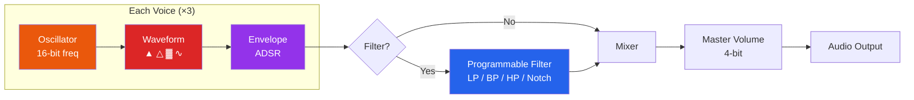

# SID Sound Interface Device (MOS 6581 / 8580)

The SID chip provides the Commodore 64 with three independent voice channels,
each with its own oscillator, waveform generator, envelope generator, and
ring modulation capability. A programmable multi-mode filter and master
volume control shape the final output.

---

## Register Map ($D400 - $D41C)

### Voice 1 Registers ($D400 - $D406)

| Offset | Address | R/W | Bits  | Name      | Description                      |
|--------|---------|-----|-------|-----------|----------------------------------|
| +$00   | `$D400` |  W  | 7-0   | FREQLO1   | Frequency low byte               |
| +$01   | `$D401` |  W  | 7-0   | FREQHI1   | Frequency high byte              |
| +$02   | `$D402` |  W  | 7-0   | PWLO1     | Pulse width low byte (bits 7-0)  |
| +$03   | `$D403` |  W  | 3-0   | PWHI1     | Pulse width high byte (bits 11-8)|
| +$04   | `$D404` |  W  | 7     | NOISE1    | Noise waveform select            |
|        |         |     | 6     | PULSE1    | Pulse waveform select            |
|        |         |     | 5     | SAW1      | Sawtooth waveform select         |
|        |         |     | 4     | TRI1      | Triangle waveform select         |
|        |         |     | 3     | TEST1     | Test bit (resets oscillator)     |
|        |         |     | 2     | RING1     | Ring modulation (with voice 3)   |
|        |         |     | 1     | SYNC1     | Oscillator sync (with voice 3)   |
|        |         |     | 0     | GATE1     | Envelope gate (1=attack, 0=rel.) |
| +$05   | `$D405` |  W  | 7-4   | ATK1      | Attack rate  (0-15)              |
|        |         |     | 3-0   | DCY1      | Decay rate   (0-15)              |
| +$06   | `$D406` |  W  | 7-4   | STN1      | Sustain level (0-15)             |
|        |         |     | 3-0   | RLS1      | Release rate  (0-15)             |

### Voice 2 Registers ($D407 - $D40D)

| Offset | Address | R/W | Bits  | Name      | Description                      |
|--------|---------|-----|-------|-----------|----------------------------------|
| +$07   | `$D407` |  W  | 7-0   | FREQLO2   | Frequency low byte               |
| +$08   | `$D408` |  W  | 7-0   | FREQHI2   | Frequency high byte              |
| +$09   | `$D409` |  W  | 7-0   | PWLO2     | Pulse width low byte             |
| +$0A   | `$D40A` |  W  | 3-0   | PWHI2     | Pulse width high byte            |
| +$0B   | `$D40B` |  W  | 7-0   | VCREG2    | Waveform / control (same as +$04)|
| +$0C   | `$D40C` |  W  | 7-0   | ATDCY2    | Attack / Decay (same as +$05)    |
| +$0D   | `$D40D` |  W  | 7-0   | SUREL2    | Sustain / Release (same as +$06) |

### Voice 3 Registers ($D40E - $D414)

| Offset | Address | R/W | Bits  | Name      | Description                      |
|--------|---------|-----|-------|-----------|----------------------------------|
| +$0E   | `$D40E` |  W  | 7-0   | FREQLO3   | Frequency low byte               |
| +$0F   | `$D40F` |  W  | 7-0   | FREQHI3   | Frequency high byte              |
| +$10   | `$D410` |  W  | 7-0   | PWLO3     | Pulse width low byte             |
| +$11   | `$D411` |  W  | 3-0   | PWHI3     | Pulse width high byte            |
| +$12   | `$D412` |  W  | 7-0   | VCREG3    | Waveform / control (same as +$04)|
| +$13   | `$D413` |  W  | 7-0   | ATDCY3    | Attack / Decay (same as +$05)    |
| +$14   | `$D414` |  W  | 7-0   | SUREL3    | Sustain / Release (same as +$06) |

### Filter & Volume Registers ($D415 - $D418)

| Offset | Address | R/W | Bits  | Name      | Description                      |
|--------|---------|-----|-------|-----------|----------------------------------|
| +$15   | `$D415` |  W  | 2-0   | FCLO      | Filter cutoff frequency low 3 bits |
| +$16   | `$D416` |  W  | 7-0   | FCHI      | Filter cutoff frequency high 8 bits |
| +$17   | `$D417` |  W  | 7-4   | RES       | Filter resonance (0-15)          |
|        |         |     | 3     | FILTEX    | Filter external input            |
|        |         |     | 2     | FILT3     | Voice 3 through filter           |
|        |         |     | 1     | FILT2     | Voice 2 through filter           |
|        |         |     | 0     | FILT1     | Voice 1 through filter           |
| +$18   | `$D418` |  W  | 7     | 3OFF      | Disconnect voice 3 from output   |
|        |         |     | 6     | HP        | High-pass filter enable          |
|        |         |     | 5     | BP        | Band-pass filter enable          |
|        |         |     | 4     | LP        | Low-pass filter enable           |
|        |         |     | 3-0   | VOL       | Master volume (0-15)             |

### Read-Only Registers ($D419 - $D41C)

| Offset | Address | R/W | Bits  | Name      | Description                      |
|--------|---------|-----|-------|-----------|----------------------------------|
| +$19   | `$D419` |  R  | 7-0   | POTX      | Paddle X / A-to-D converter      |
| +$1A   | `$D41A` |  R  | 7-0   | POTY      | Paddle Y / A-to-D converter      |
| +$1B   | `$D41B` |  R  | 7-0   | OSC3      | Voice 3 oscillator output        |
| +$1C   | `$D41C` |  R  | 7-0   | ENV3      | Voice 3 envelope output          |

---

## Voice Architecture

Each of the three SID voices follows the same signal path:

```
                                   Ring Mod
                                   source from
                                   adjacent voice
                                      |
                                      v
  +----------+    +-----------+    +------+    +----------+
  |          |    | Waveform  |    | Ring |    | Envelope |
  | 24-bit   |--->| Selector  |--->| Mod  |--->| Generator|---+
  |Oscillator|    |           |    |      |    | (ADSR)   |   |
  | (phase   |    | TRI/SAW/  |    +------+    +----------+   |
  |  accum.) |    | PULSE/    |                               |
  +----+-----+    | NOISE     |                               |
       |          +-----------+                               |
       |                                                      |
       | Hard Sync                                            |
       | (resets adjacent                                     |
       |  voice's oscillator)                                 |
       v                                                      v
  To adjacent                                      12-bit amplitude
  voice osc.                                              |
                                                          v
                                                 +--------+--------+
                                                 |   Filter?       |
                                                 | (per-voice      |
                                                 |  enable bit)    |
                                                 +--------+--------+
                                                          |
                                    +---------------------+
                                    |
          +-------------------------+-------------------------+
          |                         |                         |
  Voice 1 amplitude         Voice 2 amplitude         Voice 3 amplitude
          |                         |                         |
          v                         v                         v
  +-------+-----------+     +-------+-------+     +-----------+-------+
  | FILT1 -> Filter?  |     | FILT2 ->      |     | FILT3 ->          |
  +-------+-----------+     | Filter?       |     | Filter?           |
          |                 +-------+-------+     | 3OFF -> Mute?     |
          v                         v             +-----------+-------+
  +-----------+             +-----------+                     |
  | Filtered  |             | Filtered  |                     v
  |   or      |             |   or      |             +-----------+
  | Direct    |             | Direct    |             | Filtered  |
  +-----------+             +-----------+             |   or      |
          |                         |                 | Direct    |
          +------------+------------+                 +-----------+
                       |                                      |
                       +-------------------+------------------+
                                           |
                                    +------+------+
                                    |   Mixer     |
                                    +------+------+
                                           |
                                    +------+------+
                                    |   Master    |
                                    |   Volume    |
                                    |   (4-bit)   |
                                    +------+------+
                                           |
                                           v
                                      Audio Output
```

### Signal Path Diagram



---

## Waveform Descriptions

### Triangle

```
  Output
    ^
    |      /\        /\
    |     /  \      /  \
    |    /    \    /    \
    |   /      \  /      \
    +--/--------\/--------\-----> Phase
```

A smooth, odd-harmonic waveform. The upper bit of the oscillator accumulator
is XORed to produce the folding effect. Ring modulation XORs voice N's
triangle with the MSB of the adjacent voice's oscillator, creating
bell-like or metallic tones.

### Sawtooth

```
  Output
    ^
    |   /|    /|    /|
    |  / |   / |   / |
    | /  |  /  |  /  |
    |/   | /   | /   |
    +----+/----+/----+---------> Phase
```

A bright, harmonically rich waveform containing all harmonics. The raw
24-bit oscillator accumulator value (upper 12 bits) is output directly.
Useful for brassy or string-like tones.

### Pulse (Variable Width)

```
  Pulse Width = 50% (square)      Pulse Width = 25%
  Output                          Output
    ^                               ^
    | +----+    +----+              | +--+      +--+
    | |    |    |    |              | |  |      |  |
    | |    |    |    |              | |  |      |  |
    +-+----+----+----+---->         +-+--+------+--+-------->
```

The pulse width is set by the 12-bit PW register ($D402/$D403).
A value of $800 produces a 50% duty cycle (square wave). The duty cycle
affects the harmonic content: 50% has only odd harmonics (like triangle
but brighter); narrower widths have more harmonics and a thinner,
reedy sound. PWM (pulse width modulation) creates lush, animated sounds.

### Noise

```
  Output
    ^
    |  _   _     __   _    _
    | | |_| |   |  |_| |  | |__
    | |      |__|       |__|
    +------------------------------> Phase
```

A 23-bit LFSR (Linear Feedback Shift Register) produces pseudo-random
output. The shift register is clocked at the oscillator frequency,
so the noise "pitch" can be controlled. Useful for percussion, wind
effects, and explosions.

### Combined Waveforms

When multiple waveform bits are set simultaneously (e.g., TRI + SAW),
the SID performs a logical AND of the waveform outputs. This produces
characteristic thin, nasal tones unique to the SID. The results differ
between the 6581 and 8580 chip revisions due to different internal
implementation:

| Combination   | 6581 Behavior              | 8580 Behavior             |
|---------------|----------------------------|---------------------------|
| TRI + SAW     | Thin, nasal tone           | Similar but louder        |
| TRI + PULSE   | Hollow, clarinet-like      | Louder, less filtering    |
| SAW + PULSE   | Bright, buzzy              | Slightly different timbre |
| TRI+SAW+PULSE | Very thin, quiet           | Louder variant            |
| NOISE + any   | Resets noise LFSR (avoid!) | Same (corrupts noise)     |

### Waveform Selection Guide

| Waveform | Control Bit | Character | Best For |
|----------|------------|-----------|----------|
| Triangle | $D404 bit 4 | Smooth, mellow | Bass lines, flutes |
| Sawtooth | $D404 bit 5 | Bright, buzzy | Lead melodies, brass |
| Pulse    | $D404 bit 6 | Variable (width) | Rich pads, strings (PWM) |
| Noise    | $D404 bit 7 | Random, harsh | Drums, explosions, wind |

---

## ADSR Envelope Generator

Each voice has a 4-stage envelope: Attack, Decay, Sustain, Release.

```
  Amplitude
  (0-255)
    ^
    |         /\
    |        / |\
    |       /  | \___________
    |      /   |  |  Sustain |\_
    |     /    |  |  Level   |  \_
    |    /     |  |          |    \_
    |   / A    |D |    S     | R    \_
    +--/-------+--+----------+--------+---> Time
       ^       ^              ^
       |       |              |
     Gate ON   |            Gate OFF
             Attack          Release
             complete        begins
```

### ADSR Rate Values

The Attack, Decay, and Release rates use the same lookup table.
The value 0-15 maps to the following durations:

| Value | Attack Time | Decay/Release Time | Description        |
|-------|-------------|--------------------|--------------------|
|   0   |     2 ms    |       6 ms         | Fastest            |
|   1   |     8 ms    |      24 ms         |                    |
|   2   |    16 ms    |      48 ms         |                    |
|   3   |    24 ms    |      72 ms         |                    |
|   4   |    38 ms    |     114 ms         |                    |
|   5   |    56 ms    |     168 ms         |                    |
|   6   |    68 ms    |     204 ms         |                    |
|   7   |    80 ms    |     240 ms         |                    |
|   8   |   100 ms    |     300 ms         |                    |
|   9   |   250 ms    |     750 ms         |                    |
|  10   |   500 ms    |    1500 ms         |                    |
|  11   |   800 ms    |    2400 ms         |                    |
|  12   |  1000 ms    |    3000 ms         | (1 second attack)  |
|  13   |  3000 ms    |    9000 ms         |                    |
|  14   |  5000 ms    |   15000 ms         |                    |
|  15   |  8000 ms    |   24000 ms         | Slowest (24 sec)   |

> **Note:** Attack rates are approximately 3x faster than Decay/Release
> rates for the same register value. This is because Attack increments
> a counter while Decay/Release decrement it, using different step sizes.

### Envelope Counter Operation

The SID envelope uses an 8-bit counter (0-255) and a 15-bit rate counter:

```
  Gate ON:
    1. ATTACK phase: counter increments from 0 to 255
       Rate determined by ATK register value
    2. DECAY phase: counter decrements from 255 to (SUSTAIN * 17)
       Rate determined by DCY register value
    3. SUSTAIN phase: counter holds at (SUSTAIN * 17)
       Sustain level 0-15 maps to 0, 17, 34, ... 255

  Gate OFF:
    4. RELEASE phase: counter decrements from current value to 0
       Rate determined by RLS register value
```

---

## Filter

The SID contains a single programmable multi-mode filter shared by all voices.

### Filter Cutoff Frequency

The 11-bit cutoff frequency register controls the filter corner frequency:

```
  Cutoff = (FCHI << 3) | (FCLO & 7)

  6581: ~30 Hz (min) to ~12 kHz (max)  -- non-linear curve
  8580: ~30 Hz (min) to ~12 kHz (max)  -- more linear curve
```

### Filter Modes

| Mode Bits (HP/BP/LP) | Mode          | Description                              |
|-----------------------|---------------|------------------------------------------|
| `%001` (LP only)     | Low-pass      | Passes frequencies below cutoff          |
| `%010` (BP only)     | Band-pass     | Passes frequencies around cutoff         |
| `%100` (HP only)     | High-pass     | Passes frequencies above cutoff          |
| `%011` (LP + BP)     | LP + BP       | Combined low and band pass               |
| `%101` (LP + HP)     | Notch (reject)| Rejects frequencies around cutoff        |
| `%110` (BP + HP)     | BP + HP       | Combined band and high pass              |
| `%111` (all)         | All modes     | All three simultaneously                 |
| `%000`               | Filter off    | Signal passes through unfiltered         |

### Filter Frequency Response

```
  Low-Pass                Band-Pass               High-Pass
  Gain                    Gain                    Gain
    ^                       ^                       ^
    | ___                   |                       |            ___
    ||   \                  |    /\                  |           /
    ||    \                 |   /  \                 |          /
    ||     \                |  /    \                |         /
    ||      \___            | /      \___            |    ___/
    +----------+--->        +--+------+--->          +---+--------->
               Fc              Fc                       Fc
                                                  Frequency -->

  Notch (LP + HP)           Resonance Effect
  Gain                      Gain
    ^                         ^
    | __      __              |     /\
    ||  \    /  |             | ___/  \
    ||   \  /   |             ||      |\___
    ||    \/    |             ||      |
    ||     |    |             ||      |
    +------+----+--->         +-------+--------->
           Fc                        Fc
```

### Resonance

The RES field (bits 7-4 of `$D417`) controls the filter resonance from
0 (no resonance) to 15 (maximum). Higher resonance amplifies frequencies
near the cutoff, creating a sharper, more pronounced filter sweep.
At maximum resonance, the filter approaches self-oscillation.

---

## Frequency Calculation

The SID oscillator frequency is derived from a 24-bit phase accumulator
that increments by the 16-bit frequency register value each clock cycle.

```
  Frequency (Hz) = (Freg * Fclk) / 16777216

  Where:
    Freg  = 16-bit frequency register (FREQHI:FREQLO)
    Fclk  = System clock frequency
             PAL:  985248 Hz
             NTSC: 1022727 Hz
```

### Common Note Frequencies

| Note  | Freq (Hz) | PAL Freg | NTSC Freg | Registers (PAL)    |
|-------|-----------|----------|-----------|--------------------|
| C-0   |    16.35  |     278  |      268  | LO=$16, HI=$01    |
| C-1   |    32.70  |     557  |      536  | LO=$2D, HI=$02    |
| C-2   |    65.41  |    1114  |     1073  | LO=$5A, HI=$04    |
| C-3   |   130.81  |    2227  |     2145  | LO=$B3, HI=$08    |
| A-3   |   220.00  |    3744  |     3607  | LO=$A0, HI=$0E    |
| C-4   |   261.63  |    4455  |     4291  | LO=$67, HI=$11    |
| A-4   |   440.00  |    7488  |     7215  | LO=$40, HI=$1D    |
| C-5   |   523.25  |    8910  |     8583  | LO=$CE, HI=$22    |
| C-6   |  1046.50  |   17820  |    17166  | LO=$9C, HI=$45    |
| C-7   |  2093.00  |   35641  |    34332  | LO=$39, HI=$8B    |
| C-8   |  4186.01  |   65535* |    65535* | LO=$FF, HI=$FF    |

*Maximum register value, actual frequency may not reach C-8.

---

## Example: Playing a Note in BASIC

Play a middle-A (440 Hz) square wave with medium attack and short release:

```basic
10 REM *** SID EXAMPLE - PLAY A NOTE ***
20 REM CLEAR ALL SID REGISTERS
30 FOR I = 54272 TO 54296: POKE I, 0: NEXT
40 REM
50 REM SET VOICE 1 FREQUENCY (440 HZ, PAL)
60 POKE 54272, 64    : REM FREQ LOW  = $40
70 POKE 54273, 29    : REM FREQ HIGH = $1D
80 REM
90 REM SET PULSE WIDTH TO 50% (SQUARE WAVE)
100 POKE 54274, 0    : REM PW LOW  = $00
110 POKE 54275, 8    : REM PW HIGH = $08  (= $800 = 2048 = 50%)
120 REM
130 REM SET ATTACK=2, DECAY=6
140 POKE 54277, 38   : REM ATK=2, DCY=6  ($26)
150 REM SET SUSTAIN=10, RELEASE=4
160 POKE 54278, 164  : REM STN=10, RLS=4 ($A4)
170 REM
180 REM SET VOLUME TO MAXIMUM
190 POKE 54296, 15   : REM VOL = 15
200 REM
210 REM SELECT PULSE WAVEFORM, GATE ON
220 POKE 54276, 65   : REM PULSE=$40 + GATE=$01 = $41
230 REM
240 REM WAIT, THEN RELEASE
250 FOR I = 1 TO 500: NEXT
260 POKE 54276, 64   : REM GATE OFF (RELEASE PHASE)
270 FOR I = 1 TO 200: NEXT
280 REM
290 REM SILENCE
300 POKE 54296, 0    : REM VOLUME OFF
```

### SID Register Address Quick Reference

```
  $D400 = 54272 (decimal)

  Voice 1: 54272 - 54278  ($D400 - $D406)
  Voice 2: 54279 - 54285  ($D407 - $D40D)
  Voice 3: 54286 - 54292  ($D40E - $D414)
  Filter:  54293 - 54294  ($D415 - $D416)  cutoff
           54295          ($D417)           resonance + routing
  Volume:  54296          ($D418)           mode + master volume
  Read:    54297 - 54300  ($D419 - $D41C)  paddles, osc3, env3
```

### Complete BASIC Melody Example

```basic
10 REM *** SIMPLE MELODY ***
20 S=54272: REM SID base address
30 POKE S+24, 15: REM Max volume
40 POKE S+5, 9: REM Attack=0, Decay=9
50 POKE S+6, 0: REM Sustain=0, Release=0
60 REM Note data: freq_hi, freq_lo, duration
70 DATA 17,37,20, 19,63,20, 21,154,20, 23,59,20
80 DATA 25,177,20, 28,214,20, 32,94,20, 34,75,40
90 FOR N=1 TO 8
100 READ HI,LO,DUR
110 POKE S+1,HI: POKE S,LO: REM Set frequency
120 POKE S+4, 17: REM Gate ON + triangle wave
130 FOR T=1 TO DUR*10: NEXT T
140 POKE S+4, 16: REM Gate OFF
150 FOR T=1 TO 50: NEXT T: REM Brief silence
160 NEXT N
170 POKE S+24, 0: REM Volume off
```

---

## SID Chip Revisions

| Feature              | 6581 (original)          | 8580 (revised)            |
|----------------------|--------------------------|---------------------------|
| Supply voltage       | 12V                      | 9V                        |
| Filter response      | Non-linear, darker       | More linear, brighter     |
| Combined waveforms   | Quieter, unique textures | Louder, different mix     |
| DC offset            | Present (audible clicks) | Minimal                   |
| Noise floor          | Higher                   | Lower                     |
| Digi playback        | Volume register trick    | PWM / sample technique    |
| Found in             | Early C64 (breadbin)     | Late C64, C64C            |

> **Emulation note:** The `retro64-core` SID implementation models both
> chip revisions and can be switched at runtime. The default is 6581
> behavior, as most classic software was designed for it.
