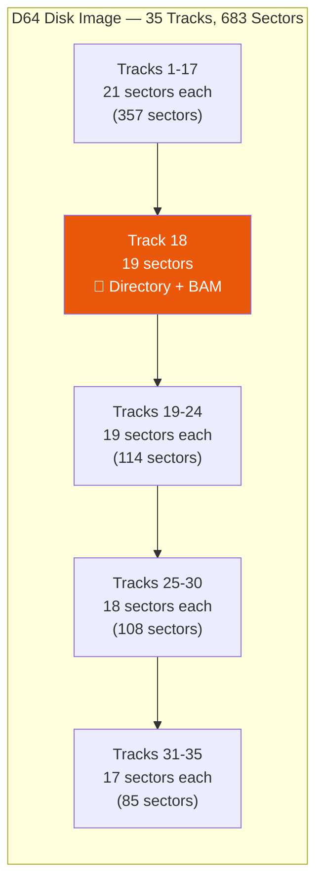
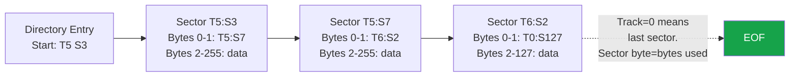

# Storage Formats

Retro64 supports the most common Commodore 64 file and disk image formats. This
document describes the layout of each format.

## PRG Format

The simplest and most common Commodore 64 program format.

### Structure

```
Offset  Size     Description
------  -------  --------------------------------
0x0000  2 bytes  Load address (little-endian)
0x0002  N bytes  Raw program data
```

The two-byte header specifies where in C64 memory the data should be placed. For
BASIC programs this is typically $0801. For machine language programs it can be any
address.

### Example

A file beginning with `01 08 ...` loads at $0801, the default start of BASIC
program memory.

### Notes

- PRG is the native format used by the host filesystem extension (device #10).
- Both BASIC and machine language programs use this format.
- There is no checksum or length field; the file size minus 2 determines the data
  length.

## D64 Disk Image

A sector-for-sector copy of a standard 1541 floppy disk.

### Geometry

- **Total size:** 174,848 bytes (683 sectors of 256 bytes each)
- **Tracks:** 35
- **Sector size:** 256 bytes



Sectors per track vary by zone:

| Tracks | Sectors per Track | Total Sectors |
|--------|-------------------|---------------|
| 1-17   | 21                | 357           |
| 18-24  | 19                | 133           |
| 25-30  | 18                | 108           |
| 31-35  | 17                | 85            |
| **Total** |                | **683**       |

### Track 18 -- Directory and BAM

Track 18 is reserved for disk management and is not available for file storage.

#### BAM (Block Availability Map) -- Track 18, Sector 0

| Offset | Size    | Description                                 |
|--------|---------|---------------------------------------------|
| 0x00   | 1 byte  | Track of first directory sector (usually 18) |
| 0x01   | 1 byte  | Sector of first directory sector (usually 1) |
| 0x02   | 1 byte  | DOS version type (0x41 = "A")               |
| 0x03   | 1 byte  | Unused                                      |
| 0x04   | 140 bytes | BAM entries for tracks 1-35 (4 bytes each)|
| 0x90   | 16 bytes  | Disk name (padded with $A0)               |
| 0xA0   | 2 bytes   | $A0 padding                               |
| 0xA2   | 2 bytes   | Disk ID                                   |
| 0xA4   | 1 byte    | $A0 padding                               |
| 0xA5   | 2 bytes   | DOS type ("2A")                           |
| 0xA7   | 4 bytes   | $A0 padding                               |

Each 4-byte BAM entry consists of a free-sector count for that track followed by a
3-byte bitmap where each bit represents one sector (1 = free, 0 = allocated).

#### Directory -- Track 18, Sector 1+

Each directory sector holds **8 entries** of **32 bytes** each. The first two bytes
of the sector are a track/sector pointer to the next directory sector (0/0 if this is
the last one).

**Directory entry format (32 bytes):**

| Offset | Size     | Description                             |
|--------|----------|-----------------------------------------|
| 0x00   | 1 byte   | Next dir track (first entry only) / $00 |
| 0x01   | 1 byte   | Next dir sector (first entry only)      |
| 0x02   | 1 byte   | File type (+ flags in upper bits)       |
| 0x03   | 1 byte   | First data track                        |
| 0x04   | 1 byte   | First data sector                       |
| 0x05   | 16 bytes | Filename (padded with $A0)              |
| 0x15   | 2 bytes  | Side-sector track/sector (REL files)    |
| 0x17   | 1 byte   | REL record length                       |
| 0x18   | 6 bytes  | Unused                                  |
| 0x1E   | 2 bytes  | File size in sectors (little-endian)    |

Common file types: $80 = DEL, $81 = SEQ, $82 = PRG, $83 = USR, $84 = REL.

### File Chain

File data is stored as a linked list of sectors. The first two bytes of every data
sector form a track/sector pointer to the next sector in the chain.



- **Non-final sector:** Byte 0 = next track, Byte 1 = next sector. Bytes 2-255
  contain 254 bytes of file data.
- **Final sector:** Byte 0 = $00, Byte 1 = N where N is the number of data bytes
  used in this sector (bytes 2 through N+1 contain valid data).

## TAP Tape Image

Raw tape pulse data, capturing the exact signal timing from a Datasette.

### Header

| Offset | Size     | Description                              |
|--------|----------|------------------------------------------|
| 0x00   | 12 bytes | Signature: `C64-TAPE-RAW`                |
| 0x0C   | 1 byte   | Version (0 or 1)                         |
| 0x0D   | 3 bytes  | Padding (reserved, zero)                 |
| 0x10   | 4 bytes  | Data size in bytes (little-endian)       |
| 0x14   | ...      | Pulse data                               |

### Pulse Data

Each byte in the data section represents the duration of one pulse. The actual
duration in CPU cycles is:

```
duration_cycles = byte_value * 8
```

#### Version 0

All pulse durations are encoded as single bytes. Very long pulses cannot be
represented.

#### Version 1

A byte value of **0x00** signals an overflow and is followed by **3 bytes**
(little-endian) giving the exact pulse duration in CPU cycles. This allows
representation of arbitrarily long pauses.

```
0x00  LL  MM  HH    ->  duration = HH:MM:LL (24-bit LE, in CPU cycles)
```

## T64 Tape Container

A container format that stores one or more PRG files. Unlike TAP, this is not raw
tape data -- it simply packages program files with metadata.

### Header (64 bytes)

| Offset | Size     | Description                                |
|--------|----------|--------------------------------------------|
| 0x00   | 32 bytes | Signature, typically `C64 TAPE FILE`...    |
| 0x20   | 2 bytes  | Version (little-endian, usually $0100)     |
| 0x22   | 2 bytes  | Maximum directory entries (little-endian)  |
| 0x24   | 2 bytes  | Used entries (little-endian)               |
| 0x26   | 2 bytes  | Unused                                     |
| 0x28   | 24 bytes | Container name (padded with $20)           |

### Directory Entries (offset 64, 32 bytes each)

| Offset | Size     | Description                                |
|--------|----------|--------------------------------------------|
| 0x00   | 1 byte   | Entry type (0 = free, 1 = normal tape file)|
| 0x01   | 1 byte   | C64 file type (same as D64 types)          |
| 0x02   | 2 bytes  | Start address (little-endian)              |
| 0x04   | 2 bytes  | End address (little-endian)                |
| 0x06   | 2 bytes  | Unused                                     |
| 0x08   | 4 bytes  | Offset of data in the T64 file (32-bit LE) |
| 0x0C   | 4 bytes  | Unused                                     |
| 0x10   | 16 bytes | Filename (padded with $20)                 |

The actual file data (raw bytes, no 2-byte load address header) is stored at the
offset given in each directory entry. The data length is `end_address - start_address`.

## CRT Cartridge

ROM cartridge images with full bank-switching metadata.

### CRT Header

| Offset | Size     | Description                                    |
|--------|----------|------------------------------------------------|
| 0x00   | 16 bytes | Signature: `C64 CARTRIDGE   ` (space-padded)   |
| 0x10   | 4 bytes  | Header length (big-endian, usually $00000040)   |
| 0x14   | 2 bytes  | CRT version (big-endian, e.g., $0100)           |
| 0x16   | 2 bytes  | Hardware type (big-endian)                      |
| 0x18   | 1 byte   | EXROM line (0 = active/low)                     |
| 0x19   | 1 byte   | GAME line (0 = active/low)                      |
| 0x1A   | 6 bytes  | Reserved                                        |
| 0x20   | 32 bytes | Cartridge name (null-terminated)                |

### CHIP Packets

Following the header, one or more CHIP packets describe the ROM banks:

| Offset | Size     | Description                                    |
|--------|----------|------------------------------------------------|
| 0x00   | 4 bytes  | Signature: `CHIP`                              |
| 0x04   | 4 bytes  | Total packet length including header (BE)       |
| 0x08   | 2 bytes  | Chip type (big-endian): 0=ROM, 1=RAM, 2=Flash  |
| 0x0A   | 2 bytes  | Bank number (big-endian)                        |
| 0x0C   | 2 bytes  | Load address (big-endian)                       |
| 0x0E   | 2 bytes  | ROM size (big-endian)                           |
| 0x10   | N bytes  | ROM data                                        |

### Common Hardware Types

| Type | Description                    | Banks | Mapping              |
|------|--------------------------------|-------|----------------------|
| 0    | Standard 8K/16K cartridge      | 1     | $8000 and/or $A000   |
| 1    | Action Replay                  | 4-8   | $8000, I/O           |
| 5    | Ocean Type 1                   | 32    | $8000                |
| 15   | C64 Game System                | 64    | $8000                |
| 19   | Magic Desk / Domark / HES Aust| 32-128| $8000                |
| 32   | EasyFlash                      | 64    | $8000 + $A000        |

**Type 0 (Standard Cartridge):**
- 8K cartridge: single 8K ROM at $8000, EXROM=0 GAME=1.
- 16K cartridge: 8K at $8000 + 8K at $A000, EXROM=0 GAME=0.

## CLI Loading Examples

```bash
# Load a PRG file
cargo run -- --load game.prg

# Load first program from a D64 disk image
cargo run -- --load games.d64

# Load from a T64 tape archive
cargo run -- --load archive.t64

# Load a cartridge ROM
cargo run -- --load cart.crt
```
