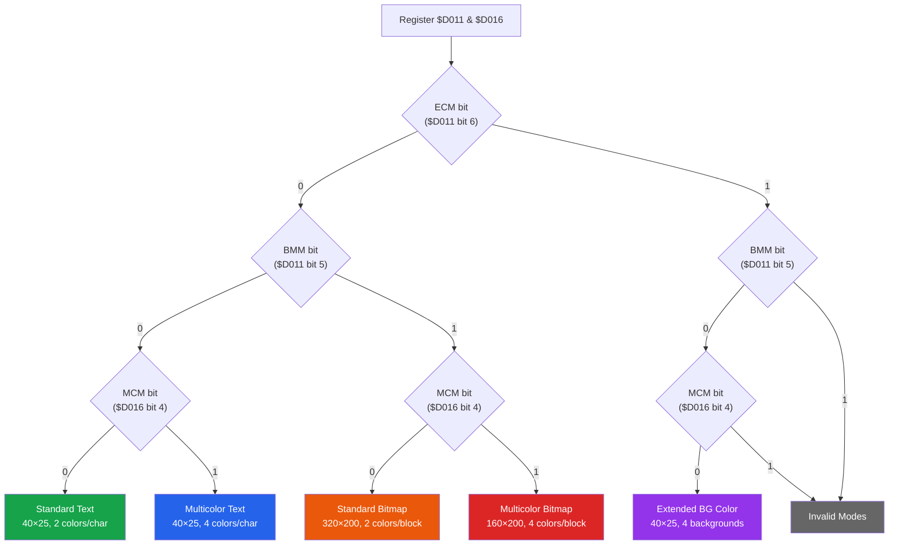
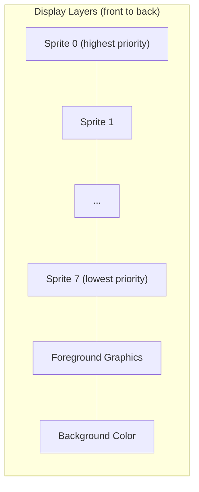

# VIC-II Video Interface Controller (MOS 6569 / 6567)

The VIC-II is the video chip of the Commodore 64, responsible for generating
the video signal, managing sprites, and handling raster interrupts. The PAL
version (6569) and NTSC version (6567/8567) differ in timing and resolution.

---

## Register Map ($D000 - $D02E)

All registers are accessible at `$D000-$D3FF` (1 KB, mirrored every 64 bytes).

### Sprite Position Registers ($D000-$D010)

| Register | Address | Bits    | Description                          |
|----------|---------|---------|--------------------------------------|
| SP0X     | `$D000` | 7-0     | Sprite 0 X position (low 8 bits)     |
| SP0Y     | `$D001` | 7-0     | Sprite 0 Y position                  |
| SP1X     | `$D002` | 7-0     | Sprite 1 X position (low 8 bits)     |
| SP1Y     | `$D003` | 7-0     | Sprite 1 Y position                  |
| SP2X     | `$D004` | 7-0     | Sprite 2 X position (low 8 bits)     |
| SP2Y     | `$D005` | 7-0     | Sprite 2 Y position                  |
| SP3X     | `$D006` | 7-0     | Sprite 3 X position (low 8 bits)     |
| SP3Y     | `$D007` | 7-0     | Sprite 3 Y position                  |
| SP4X     | `$D008` | 7-0     | Sprite 4 X position (low 8 bits)     |
| SP4Y     | `$D009` | 7-0     | Sprite 4 Y position                  |
| SP5X     | `$D00A` | 7-0     | Sprite 5 X position (low 8 bits)     |
| SP5Y     | `$D00B` | 7-0     | Sprite 5 Y position                  |
| SP6X     | `$D00C` | 7-0     | Sprite 6 X position (low 8 bits)     |
| SP6Y     | `$D00D` | 7-0     | Sprite 6 Y position                  |
| SP7X     | `$D00E` | 7-0     | Sprite 7 X position (low 8 bits)     |
| SP7Y     | `$D00F` | 7-0     | Sprite 7 Y position                  |
| MSIGX    | `$D010` | 7-0     | Sprites 0-7 X position MSB (bit 8)   |

### Control & Status Registers ($D011-$D01F)

| Register | Address | Bits  | Description                                  |
|----------|---------|-------|----------------------------------------------|
| CR1      | `$D011` | 7     | Raster compare bit 8 (MSB)                   |
|          |         | 6     | ECM - Extended Color Mode                    |
|          |         | 5     | BMM - Bitmap Mode                            |
|          |         | 4     | DEN - Display Enable                         |
|          |         | 3     | RSEL - Row Select (0=24 rows, 1=25 rows)     |
|          |         | 2-0   | YSCROLL - Vertical scroll (0-7)              |
| RASTER   | `$D012` | 7-0   | Raster counter (read) / Raster compare (write) |
| LPX      | `$D013` | 7-0   | Light pen X position                         |
| LPY      | `$D014` | 7-0   | Light pen Y position                         |
| SPENA    | `$D015` | 7-0   | Sprite enable (1 bit per sprite)             |
| CR2      | `$D016` | 7-6   | Unused (always read as 1)                    |
|          |         | 5     | RES - Reset (unused in C64)                  |
|          |         | 4     | MCM - Multicolor Mode                        |
|          |         | 3     | CSEL - Column Select (0=38 cols, 1=40 cols)  |
|          |         | 2-0   | XSCROLL - Horizontal scroll (0-7)            |
| SPYEX    | `$D017` | 7-0   | Sprite Y expansion (1=double height)         |
| VMCSB    | `$D018` | 7-4   | Screen memory address (bits 13-10)           |
|          |         | 3-1   | Character dot data address (bits 13-11)      |
|          |         | 0     | Unused                                       |
| IRQST    | `$D019` | 7     | IRQ occurred (any source)                    |
|          |         | 3     | Light pen triggered                          |
|          |         | 2     | Sprite-sprite collision                      |
|          |         | 1     | Sprite-background collision                  |
|          |         | 0     | Raster compare match                         |
| IRQEN    | `$D01A` | 3-0   | IRQ enable mask (same bits as $D019)         |
| SPDP     | `$D01B` | 7-0   | Sprite-data priority (0=sprite in front)     |
| SPMC     | `$D01C` | 7-0   | Sprite multicolor enable                     |
| SPXEX    | `$D01D` | 7-0   | Sprite X expansion (1=double width)          |
| SPSPCL   | `$D01E` | 7-0   | Sprite-sprite collision (read, cleared)      |
| SPBGCL   | `$D01F` | 7-0   | Sprite-background collision (read, cleared)  |

### Color Registers ($D020-$D02E)

| Register | Address | Bits  | Description                          |
|----------|---------|-------|--------------------------------------|
| EXTCOL   | `$D020` | 3-0   | Border color                         |
| BGCOL0   | `$D021` | 3-0   | Background color 0                   |
| BGCOL1   | `$D022` | 3-0   | Background color 1 (ECM/MCM)        |
| BGCOL2   | `$D023` | 3-0   | Background color 2 (ECM)            |
| BGCOL3   | `$D024` | 3-0   | Background color 3 (ECM)            |
| SPMMC0   | `$D025` | 3-0   | Sprite multicolor 0 (shared)        |
| SPMMC1   | `$D026` | 3-0   | Sprite multicolor 1 (shared)        |
| SP0COL   | `$D027` | 3-0   | Sprite 0 individual color           |
| SP1COL   | `$D028` | 3-0   | Sprite 1 individual color           |
| SP2COL   | `$D029` | 3-0   | Sprite 2 individual color           |
| SP3COL   | `$D02A` | 3-0   | Sprite 3 individual color           |
| SP4COL   | `$D02B` | 3-0   | Sprite 4 individual color           |
| SP5COL   | `$D02C` | 3-0   | Sprite 5 individual color           |
| SP6COL   | `$D02D` | 3-0   | Sprite 6 individual color           |
| SP7COL   | `$D02E` | 3-0   | Sprite 7 individual color           |

---

## Graphics Modes

The VIC-II supports five main graphics modes, selected by three control bits:

- **ECM** (Extended Color Mode) -- bit 6 of `$D011`
- **BMM** (Bitmap Mode) -- bit 5 of `$D011`
- **MCM** (Multicolor Mode) -- bit 4 of `$D016`

### Mode Selection Table

| Mode                   | ECM | BMM | MCM | Resolution   | Colors per cell | Unique colors |
|------------------------|-----|-----|-----|--------------|-----------------|---------------|
| Standard Text          |  0  |  0  |  0  | 320 x 200   | 2               | 16 fg + 1 bg  |
| Multicolor Text        |  0  |  0  |  1  | 160 x 200*  | 4               | 8 fg + 4 bg   |
| Standard Bitmap        |  0  |  1  |  0  | 320 x 200   | 2 per 8x8 cell  | 16            |
| Multicolor Bitmap      |  0  |  1  |  1  | 160 x 200*  | 4 per 4x8 cell  | 16            |
| Extended BG Color Text |  1  |  0  |  0  | 320 x 200   | 2               | 16 fg + 4 bg  |
| Invalid (ECM+BMM)      |  1  |  1  |  0  | --           | --              | Displays black |
| Invalid (ECM+MCM)      |  1  |  0  |  1  | --           | --              | Displays black |
| Invalid (all set)      |  1  |  1  |  1  | --           | --              | Displays black |

*Multicolor modes have double-wide pixels (2 horizontal pixels per dot).

### Graphics Mode Selection Flowchart



### Standard Text Mode (ECM=0, BMM=0, MCM=0)

```
  Screen Memory byte           Character ROM/RAM
  +---+---+---+---+            8 bytes per character
  | character code|
  |   (0-255)     |  ------->  Byte 0: . # # # # # . .    bit=1: fg color
  +---+---+---+---+            Byte 1: # . . . . . # .    bit=0: bg color ($D021)
                               Byte 2: # . . . . . # .
  Color RAM nybble             Byte 3: # . . . . . # .
  +---+---+---+---+            Byte 4: # # # # # # . .
  | fg color 0-15 |            Byte 5: # . . . . . # .
  +---+---+---+---+            Byte 6: # . . . . . # .
                               Byte 7: . # # # # # . .
```

### Multicolor Text Mode (ECM=0, BMM=0, MCM=1)

Per-character: if Color RAM bit 3 = 0, character uses standard mode.
If Color RAM bit 3 = 1, character uses multicolor (4 colors, double-wide pixels):

```
  Bit pair    Color source
  --------    ----------------
    %00       Background 0 ($D021)
    %01       Background 1 ($D022)
    %10       Background 2 ($D023)
    %11       Color RAM (bits 2-0 only, 8 colors)
```

### Standard Bitmap Mode (ECM=0, BMM=1, MCM=0)

```
  8 KB bitmap data at address set by $D018 bit 3:
    Bit 3 = 0: bitmap at bank + $0000
    Bit 3 = 1: bitmap at bank + $2000

  Each 8-byte block maps to one 8x8 pixel cell.
  Screen memory provides fg/bg color per cell:
    High nybble = foreground (bit=1)
    Low nybble  = background (bit=0)
```

### Multicolor Bitmap Mode (ECM=0, BMM=1, MCM=1)

```
  Bit pair    Color source
  --------    --------------------------------
    %00       Background color 0 ($D021)
    %01       Screen memory high nybble
    %10       Screen memory low nybble
    %11       Color RAM nybble
```

### Extended Background Color Mode (ECM=1, BMM=0, MCM=0)

```
  Character code bits 7-6 select background color:
    %00 -> $D021 (Background 0)
    %01 -> $D022 (Background 1)
    %10 -> $D023 (Background 2)
    %11 -> $D024 (Background 3)

  Only characters 0-63 available (bits 5-0 used as char index).
  Foreground color from Color RAM as usual.
```

---

## Color Palette

The VIC-II has a fixed palette of 16 colors. Below are the hex values used
by this emulator (based on the widely-accepted "Colodore" measurements):

| Index | Name          | Hex       | Swatch |
|-------|---------------|-----------|--------|
|   0   | Black         | `#000000` | <span style="display:inline-block;width:20px;height:20px;background:#000000;border:1px solid #555;vertical-align:middle;"></span> |
|   1   | White         | `#FFFFFF` | <span style="display:inline-block;width:20px;height:20px;background:#FFFFFF;border:1px solid #555;vertical-align:middle;"></span> |
|   2   | Red           | `#880000` | <span style="display:inline-block;width:20px;height:20px;background:#880000;border:1px solid #555;vertical-align:middle;"></span> |
|   3   | Cyan          | `#AAFFEE` | <span style="display:inline-block;width:20px;height:20px;background:#AAFFEE;border:1px solid #555;vertical-align:middle;"></span> |
|   4   | Purple        | `#CC44CC` | <span style="display:inline-block;width:20px;height:20px;background:#CC44CC;border:1px solid #555;vertical-align:middle;"></span> |
|   5   | Green         | `#00CC55` | <span style="display:inline-block;width:20px;height:20px;background:#00CC55;border:1px solid #555;vertical-align:middle;"></span> |
|   6   | Blue          | `#0000AA` | <span style="display:inline-block;width:20px;height:20px;background:#0000AA;border:1px solid #555;vertical-align:middle;"></span> |
|   7   | Yellow        | `#EEEE77` | <span style="display:inline-block;width:20px;height:20px;background:#EEEE77;border:1px solid #555;vertical-align:middle;"></span> |
|   8   | Orange        | `#DD8855` | <span style="display:inline-block;width:20px;height:20px;background:#DD8855;border:1px solid #555;vertical-align:middle;"></span> |
|   9   | Brown         | `#664400` | <span style="display:inline-block;width:20px;height:20px;background:#664400;border:1px solid #555;vertical-align:middle;"></span> |
|  10   | Light Red     | `#FF7777` | <span style="display:inline-block;width:20px;height:20px;background:#FF7777;border:1px solid #555;vertical-align:middle;"></span> |
|  11   | Dark Grey     | `#333333` | <span style="display:inline-block;width:20px;height:20px;background:#333333;border:1px solid #555;vertical-align:middle;"></span> |
|  12   | Medium Grey   | `#777777` | <span style="display:inline-block;width:20px;height:20px;background:#777777;border:1px solid #555;vertical-align:middle;"></span> |
|  13   | Light Green   | `#AAFF66` | <span style="display:inline-block;width:20px;height:20px;background:#AAFF66;border:1px solid #555;vertical-align:middle;"></span> |
|  14   | Light Blue    | `#0088FF` | <span style="display:inline-block;width:20px;height:20px;background:#0088FF;border:1px solid #555;vertical-align:middle;"></span> |
|  15   | Light Grey    | `#BBBBBB` | <span style="display:inline-block;width:20px;height:20px;background:#BBBBBB;border:1px solid #555;vertical-align:middle;"></span> |

### Palette in Code (RGBA)

```rust
pub const VIC_PALETTE: [[u8; 4]; 16] = [
    [0x00, 0x00, 0x00, 0xFF], // 0  Black
    [0xFF, 0xFF, 0xFF, 0xFF], // 1  White
    [0x88, 0x00, 0x00, 0xFF], // 2  Red
    [0xAA, 0xFF, 0xEE, 0xFF], // 3  Cyan
    [0xCC, 0x44, 0xCC, 0xFF], // 4  Purple
    [0x00, 0xCC, 0x55, 0xFF], // 5  Green
    [0x00, 0x00, 0xAA, 0xFF], // 6  Blue
    [0xEE, 0xEE, 0x77, 0xFF], // 7  Yellow
    [0xDD, 0x88, 0x55, 0xFF], // 8  Orange
    [0x66, 0x44, 0x00, 0xFF], // 9  Brown
    [0xFF, 0x77, 0x77, 0xFF], // 10 Light Red
    [0x33, 0x33, 0x33, 0xFF], // 11 Dark Grey
    [0x77, 0x77, 0x77, 0xFF], // 12 Medium Grey
    [0xAA, 0xFF, 0x66, 0xFF], // 13 Light Green
    [0x00, 0x88, 0xFF, 0xFF], // 14 Light Blue
    [0xBB, 0xBB, 0xBB, 0xFF], // 15 Light Grey
];
```

---

## Sprite Specifications

### Physical Characteristics

| Property              | Standard Mode  | Multicolor Mode   |
|-----------------------|----------------|-------------------|
| Resolution            | 24 x 21 pixels | 12 x 21 pixels*  |
| Data size             | 63 bytes       | 63 bytes          |
| Colors per sprite     | 2 (bg + 1 fg)  | 4 (bg + 3 colors) |
| Maximum sprites       | 8              | 8                 |
| X range               | 0-511 (9-bit)  | 0-511 (9-bit)     |
| Y range               | 0-255 (8-bit)  | 0-255 (8-bit)     |
| X expansion           | 48 pixels wide | 24 pixels wide*   |
| Y expansion           | 42 pixels tall | 42 pixels tall    |
| Visible area (PAL)    | X: 24-343      | same              |

*Multicolor sprites use double-wide pixels.

### Sprite Data Layout (63 bytes)

```
  Byte 0                    Byte 1                    Byte 2
  Bit: 7 6 5 4 3 2 1 0     Bit: 7 6 5 4 3 2 1 0     Bit: 7 6 5 4 3 2 1 0
       . # # # # # . .          . . . # # . . .          . . . . . . . .
                                                                            Row 0
  Byte 3                    Byte 4                    Byte 5
       . # . . . . # .          . . . # # . . .          . . . . . . . .
                                                                            Row 1
  ...continues for 21 rows (63 bytes total, 3 bytes per row)...

  Standard mode:  bit = 1 -> sprite color,  bit = 0 -> transparent
  Multicolor:     %00 = transparent
                  %01 = sprite multicolor 0 ($D025)
                  %10 = sprite individual color ($D027+n)
                  %11 = sprite multicolor 1 ($D026)
```

### Sprite Pointer Location

Sprite data pointers are the last 8 bytes of the 1 KB screen memory block:

```
  Screen base + $03F8 = Sprite 0 pointer
  Screen base + $03F9 = Sprite 1 pointer
  Screen base + $03FA = Sprite 2 pointer
  Screen base + $03FB = Sprite 3 pointer
  Screen base + $03FC = Sprite 4 pointer
  Screen base + $03FD = Sprite 5 pointer
  Screen base + $03FE = Sprite 6 pointer
  Screen base + $03FF = Sprite 7 pointer

  Pointer value * 64 = address of sprite data within VIC bank
  Example: Pointer = $0D -> sprite data at bank + $0340
```

### Sprite Priority & Collision

```
  Display layering (front to back):
  +----------------------------------+
  |  Border                          |  (always on top)
  |  +----------------------------+  |
  |  | Sprite 0  (highest)       |  |
  |  | Sprite 1                  |  |
  |  | Sprite 2                  |  |
  |  | Sprite 3                  |  |  Sprite-Sprite collision:
  |  | Foreground graphics       |  |    $D01E (read & clear)
  |  | Sprite 4                  |  |
  |  | Sprite 5                  |  |  Sprite-Background collision:
  |  | Sprite 6                  |  |    $D01F (read & clear)
  |  | Sprite 7  (lowest)       |  |
  |  | Background graphics       |  |
  |  +----------------------------+  |
  +----------------------------------+

### Sprite Priority Diagram



  Sprite priority bit ($D01B):
    0 = Sprite appears in front of foreground graphics
    1 = Sprite appears behind foreground graphics
    (Sprites always appear in front of background graphics)
```

---

## VIC-II BASIC Programming Examples

```basic
REM === Change colors ===
POKE 53280, 0    : REM Black border
POKE 53281, 6    : REM Blue background

REM === Enable sprite 0 ===
POKE 53269, 1    : REM Enable sprite 0
POKE 53248, 160  : REM Sprite 0 X position
POKE 53249, 140  : REM Sprite 0 Y position
POKE 2040, 13    : REM Sprite pointer → block 13 ($0340)
POKE 53287, 1    : REM Sprite 0 color = white
REM Fill sprite data with a ball shape
FOR I=0 TO 62: POKE 832+I, 255: NEXT

REM === Switch to bitmap mode ===
POKE 53265, PEEK(53265) OR 32   : REM Set BMM bit
POKE 53272, PEEK(53272) OR 8    : REM Bitmap at $2000
```

---

## PAL vs NTSC Screen Dimensions

```
                    PAL (6569)              NTSC (6567R8)
                    ==========              =============
  Clock frequency:  0.985248 MHz            1.022727 MHz
  Cycles per line:  63                      65
  Total lines:      312                     263
  Visible lines:    284                     235
  Visible columns:  403                     418
  First vblank:     line 300                line 13
  Last vblank:      line 15                 line 40
  First visible X:  cycle 12                cycle 12
  Frames per sec:   50.125 Hz              59.826 Hz
  Border (top):     lines 0-50             lines 41-50
  Display area:     lines 51-250           lines 51-250
  Border (bottom):  lines 251-311          lines 251-262
```

### Raster Line Layout (PAL, 63 cycles per line)

```
  Cycle:  1    12         16                                55    63
          |    |          |                                  |     |
          +----+----------+----------------------------------+-----+
          |SYNC| Left     |      Visible Display Area       |Right|
          |    | Border   |      (40 columns, 320 pixels)   |Bdr  |
          |    |          |                                  |     |
          +----+----------+----------------------------------+-----+
                ^                                            ^
                |-- First visible pixel                      |-- Last visible pixel

  Badline:  If DEN=1 and (RASTER & 7) == YSCROLL,
            VIC-II steals 40-43 cycles for character fetch (c-access).
            CPU only gets ~20 cycles on a badline.
```
