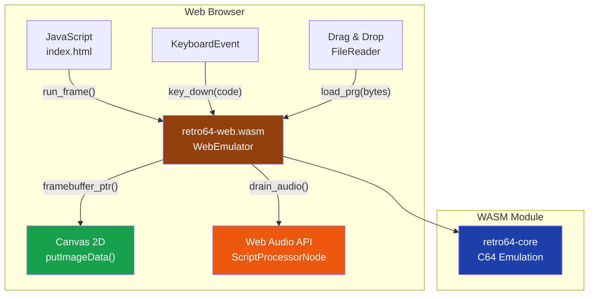

# Web Emulator

Retro64 can run in any modern web browser via WebAssembly. The web build provides
real-time Commodore 64 emulation with audio and keyboard input, entirely client-side.



## Building from Source

```bash
# Install wasm-pack
cargo install wasm-pack

# Build WASM
cd crates/retro64-web
wasm-pack build --target web --release

# Serve locally
python3 -m http.server 8080
# Open http://localhost:8080/index.html
```

The build produces a `pkg/` directory containing the `.wasm` binary and JavaScript
glue code. The `index.html` file in the crate root loads these automatically.

## Browser Requirements

- **WebAssembly:** Chrome 57+, Firefox 52+, Safari 11+, Edge 16+
- **AudioContext:** Required for SID audio playback
- **Canvas 2D:** Used for rendering the emulated display

All major browsers released since 2017 meet these requirements.

## Features

- Real-time C64 emulation at 50 Hz (PAL) or 60 Hz (NTSC)
- Canvas rendering via direct WASM memory access for minimal overhead
- Web Audio API for SID sound emulation
- Full keyboard mapping from PC keys to C64 keyboard matrix
- Drag-and-drop file loading (.prg, .d64, .t64, .crt)
- PAL/NTSC model switching at runtime
- Warp mode (uncapped speed)

## Keyboard Mapping

The web version maps standard PC keys to the C64 keyboard matrix. The mapping
uses `KeyboardEvent.code` values for layout-independent behavior.

| Web Key (`code`)        | C64 Key             |
|-------------------------|----------------------|
| `Escape`                | RUN/STOP             |
| `Tab`                   | CTRL                 |
| `Backquote`             | Left Arrow (graphics)|
| `Backspace`             | INST/DEL             |
| `Insert`                | INST (shifted DEL)   |
| `Home`                  | CLR/HOME             |
| `F1`                    | F1                   |
| `F2`                    | F2                   |
| `F3`                    | F3                   |
| `F4`                    | F4                   |
| `F5`                    | F5                   |
| `F6`                    | F6                   |
| `F7`                    | F7                   |
| `F8`                    | F8                   |
| `ArrowUp`               | CRSR UP              |
| `ArrowDown`             | CRSR DOWN            |
| `ArrowLeft`             | CRSR LEFT            |
| `ArrowRight`            | CRSR RIGHT           |
| `ControlLeft`           | CBM (Commodore key)  |
| `AltLeft` / `AltRight`  | CTRL                 |
| `ShiftLeft` / `ShiftRight` | Left/Right SHIFT |
| `Enter`                 | RETURN               |
| `Equal`                 | + (plus)             |
| `Minus`                 | - (minus)            |
| `BracketLeft`           | @ (at sign)          |
| `BracketRight`          | * (asterisk)         |
| `Semicolon`             | : (colon)            |
| `Quote`                 | ; (semicolon)        |
| `Backslash`             | = (equals)           |
| `Slash`                 | / (slash)            |
| `Period`                | . (period)           |
| `Comma`                 | , (comma)            |
| Letter/digit keys       | Corresponding C64 key|

The RESTORE key is mapped to `PageUp`.

## Drag-and-Drop Loading

Drag a `.prg`, `.d64`, `.t64`, or `.crt` file onto the browser window to load it.
PRG files are loaded directly into memory and auto-started with `RUN`. Disk images
are mounted as the active disk in device 8.

## Known Limitations

- **No disk drive emulation via web.** The 1541 drive emulation is not available in
  the web build. Use PRG files for loading programs, or drag-and-drop a D64 image
  which will be accessed via fast direct-sector reads (no true drive CPU emulation).
- **AudioContext requires user gesture.** Browsers require a user interaction (click,
  key press) before audio can start. The web UI displays a prompt to click if audio
  is not yet active.
- **ScriptProcessorNode.** The audio pipeline uses the ScriptProcessorNode API, which
  is deprecated but remains universally supported. A future update will migrate to
  AudioWorklet where available.
- **No save state support.** Snapshots and save states are not yet implemented in the
  web version.
- **Performance.** While most software runs at full speed, cycle-exact SID emulation
  can be demanding on lower-end devices. Use warp mode to test if the issue is
  CPU-bound.

### Embedding in Your Own Page

```javascript
// Minimal example: embed Retro64 in any web page
import init, { WebEmulator } from './pkg/retro64_web.js';

async function startEmulator() {
    await init();
    const emu = new WebEmulator("pal");
    
    const canvas = document.getElementById("c64screen");
    canvas.width = emu.screen_width();
    canvas.height = emu.screen_height();
    const ctx = canvas.getContext("2d");
    
    // Keyboard input
    document.addEventListener("keydown", e => {
        e.preventDefault();
        emu.key_down(e.code);
    });
    document.addEventListener("keyup", e => emu.key_up(e.code));
    
    // Load a PRG file
    async function loadFile(url) {
        const resp = await fetch(url);
        const data = new Uint8Array(await resp.arrayBuffer());
        emu.load_prg(data);
    }
    
    // Render loop
    const frameMs = 1000 / emu.target_fps();
    let lastTime = 0, accum = 0;
    
    function loop(ts) {
        accum += ts - (lastTime || ts);
        lastTime = ts;
        while (accum >= frameMs) {
            emu.run_frame();
            accum -= frameMs;
        }
        const ptr = emu.framebuffer_ptr();
        const w = emu.screen_width(), h = emu.screen_height();
        const rgba = new Uint8ClampedArray(
            emu.constructor.__wbindgen_export_0.buffer, ptr, w * h * 4
        );
        ctx.putImageData(new ImageData(rgba, w, h), 0, 0);
        requestAnimationFrame(loop);
    }
    requestAnimationFrame(loop);
}

startEmulator();
```
